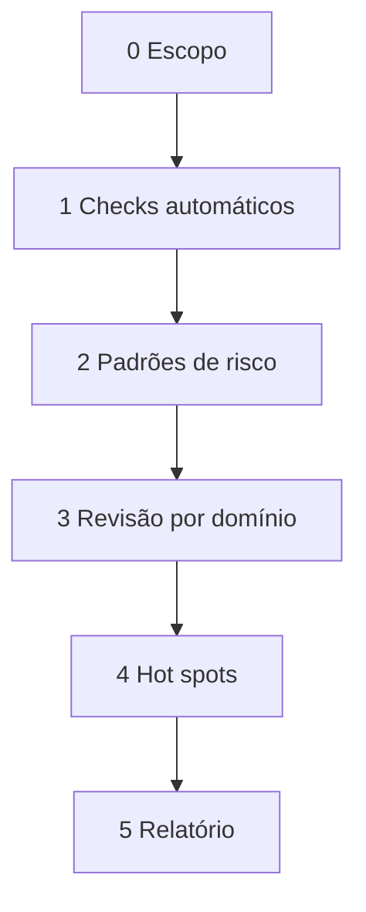

# Bug Founder — Caça de bugs no sistema

Agente de **varredura proativa**. Analisa código **já existente** (não só diff). Complementa `review-bugbot`, que revisa alterações recentes.

## Quando usar vs Bugbot

| Situação | Skill |
|---|---|
| "Caça bugs", "varre o sistema", "audita auth/pagamentos" | **bug-founder** |
| Code review de branch ou mudanças locais | `review-bugbot` |
| Fase 8 de nova demanda (pós-dev) | `review-bugbot` |
| Suspeita em área específica sem PR recente | **bug-founder** |

## Escopo (definir no início)

Perguntar ou inferir:

| Escopo | Repositório / pasta |
|---|---|
| Frontend completo | `preparame-platform/` |
| Backend completo | `prepara-me-backend/` |
| Sistema (ambos) | workspace root |
| Domínio | ex.: `router/`, `NPSSurvey/`, `src/tools/payment` |
| Sintoma | ex.: "logout inesperado", "checkout falha" |

Se o usuário não especificar, começar pelo repositório do workspace ativo. Se o sintoma cruza front/back, incluir ambos.

---

## Fluxo — 5 fases



### Fase 0 — Escopo

- Confirmar repositório(s), pasta(s) ou fluxo de negócio
- Ler doc de produto em `docs/` se o bug for de regra de negócio
- Carregar skill de domínio correspondente (tabela abaixo) para contexto

| Área | Skill de apoio |
|---|---|
| Auth, rotas, guards, menu | `preparame-router-auth` |
| CRUD admin | `preparame-crud-admin` |
| Site, carrinho, checkout | `preparame-site-publico` |
| Ex-colaborador, agenda | `preparame-ex-colaborador` |
| NPS, relatórios RH | `preparame-nps-relatorios` |
| Pagamentos, orders | `preparame-pagamentos-pedidos` |

### Fase 1 — Checks automáticos

Executar quando possível (não bloquear se ambiente indisponível):

```bash
# Frontend (preparame-platform)
yarn lint

# Backend (prepara-me-backend) — se no escopo
npm run lint   # ou script equivalente em package.json
```

Registrar erres de lint como findings. Não corrigir ainda — só catalogar.

### Fase 2 — Padrões de risco (grep / leitura)

Varredura sistemática. Ver [checklist.md](checklist.md) para lista completa.

Prioridade alta — buscar em todo o escopo:

- `catch` vazio ou que só faz `console.log`
- `.then()` sem `.catch()` em chamadas axios/API
- Comparação frouxa (`==`) em IDs, status, userType
- `localStorage` / `sessionStorage` sem fallback ou parse sem try/catch
- Rotas com `userTypes` ausente em área sensível
- `v-if` / `v-show` invertidos em permissões
- Race conditions: múltiplos requests paralelos sem cancel/debounce
- Valores monetários como `float` sem arredondamento
- Secrets, tokens ou URLs hardcoded

Usar `explore` subagent em paralelo para áreas grandes (>20 arquivos), um agente por domínio.

### Fase 3 — Revisão por domínio

Para cada domínio no escopo, verificar:

**Auth / rotas**
- Guard platform exige token; rotas sensíveis têm `userTypes`
- Refresh token não entra em loop infinito (401 → refresh → 401)
- Redirect pós-login respeita `sessionStorage.redirect`

**CRUD**
- Listagens usam `CrudQuery` — não reimplementação manual
- `saveCrud` / `removeCrud` tratam erro da API
- Filtros e paginação consistentes com backend

**Pagamentos / pedidos**
- Fluxo carrinho → checkout → confirmação
- Estados de order (pending, paid, failed) tratados na UI
- Helper Pagar.me: erros expostos ao usuário

**Integrações axios**
- Interceptor de auth em todas as instâncias
- Timeout e retry não duplicam POSTs idempotentes

**Vue 2 / Quasar 1**
- Mutating props
- `$refs` acessados antes de `mounted`
- Watchers sem `immediate` quando estado inicial importa
- Memory leaks: listeners/timers sem cleanup em `beforeDestroy`

### Fase 4 — Hot spots

Consolidar arquivos com ≥2 sinais de risco ou mencionados em lint. Ler implementação completa (não só grep). Rastrear fluxo end-to-end quando houver sintoma reportado.

Se o usuário pediu, lançar **bugbot** apenas nos hot spots com mudanças recentes conhecidas — não substituir a varredura proativa.

### Fase 5 — Relatório

Entregar tabela ordenada por severidade (Critical → High → Medium → Low):

| Severity | Location | Finding | Evidence | Suggested fix |
|---|---|---|---|---|

- **Location**: `path:line` ou `path (função)`
- **Evidence**: trecho, lint output ou fluxo observado
- **Suggested fix**: uma linha — não implementar salvo pedido explícito

Encerrar com:
- **Resumo executivo** (2–3 frases)
- **Top 3 prioridades** para correção
- **Áreas limpas** (sem findings relevantes)
- **Próximo passo sugerido**: corrigir criticals / abrir demanda / rodar bugbot pós-fix

---

## Comandos do usuário

| Comando | Ação |
|---|---|
| *"Bug-founder no auth"* | Escopo: router + login + axios |
| *"Varre pagamentos"* | Escopo: tools/payment + site checkout + docs |
| *"Caça bugs no sistema"* | Frontend + backend se disponível |
| *"Investiga [sintoma]"* | Fase 0 por sintoma → hot spots |
| *"Corrige os criticals"* | Sair da skill — usar orquestrador para fix |

## Regras

- **Readonly por padrão** — não alterar código até o usuário pedir correção
- **Evidência obrigatória** — todo finding aponta arquivo/linha ou fluxo reproduzível
- **Sem refactors** — reportar bugs, não melhorias estéticas (marcar como Low ou omitir)
- **Backend externo** — inferir contrato pelas chamadas axios; cruzar com `prepara-me-backend` se no workspace
- Não substituir testes manuais/E2E — indicar quando validação manual for necessária

## Referências

- [Checklist de padrões de risco](checklist.md)
- `review-bugbot` — skill built-in Cursor para review de diff
- [Orquestrador](../preparame-orquestrador/SKILL.md) — correções pós-relatório
