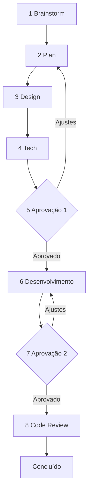

# Novas Demandas — Fluxo completo

Agente de **novas features e demandas**. Conduz do brainstorm ao code review com **gates de aprovação** antes de codar e antes de encerrar.

**Não pule fases.** **Não codifique** antes da Aprovação 1.

## Quando usar vs Orquestrador

| Situação | Agente |
|---|---|
| Nova feature, demanda, ideia, "vamos planejar" | **Este fluxo** (`preparame-novas-demandas`) |
| Bug fix, ajuste pontual, tarefa já especificada | `preparame-orquestrador` direto |
| Continuar demanda em andamento | Retomar fase indicada no arquivo da demanda |

## Artefato da demanda

Criar/atualizar arquivo em:

```
docs/desenvolvimento/demandas/YYYY-MM-DD-slug-da-demanda.md
```

Copiar estrutura de [`template.md`](../../docs/desenvolvimento/demandas/template.md).

Manter **status da fase** atualizado no frontmatter do arquivo.

---

## Fluxo — 8 fases



---

### Fase 1 — Brainstorm

**Objetivo:** entender problema, contexto, usuários impactados e ideias iniciais.

**Atividades:**
- Ler docs de produto relevantes em `docs/`
- Identificar perfis afetados (USER, ADMIN, RH, site público…)
- Listar 2–3 abordagens possíveis (sem decidir ainda)
- Levantar dúvidas e riscos iniciais

**Entregável no arquivo da demanda:**
- Contexto e problema
- Objetivo de negócio
- Perfis/personas impactados
- Ideias e alternativas
- Perguntas em aberto

**Parar e apresentar ao usuário.** Aguardar OK para Fase 2.

---

### Fase 2 — Plan

**Objetivo:** plano estruturado e escopo fechado.

**Entregável:**
- Resumo em 1 parágrafo
- Escopo **in** e **out** (explícito)
- User stories ou casos de uso
- Critérios de aceite (checklist testável)
- Dependências (backend, design, outras equipes)
- Estimativa de complexidade (P/M/G)

**Parar e apresentar.** Aguardar OK para Fase 3.

---

### Fase 3 — Design

**Objetivo:** experiência do usuário — **não código**.

**Entregável:**
- Onde na plataforma (site / plataforma logada / qual perfil)
- Fluxo do usuário (passo a passo)
- Telas/componentes afetados (nomes amigáveis)
- Estados vazios, erros, loading
- Textos principais (labels, mensagens) se relevante
- Diagrama mermaid do fluxo quando útil

Consultar [`docs/01-visao-geral/mapa-da-plataforma.md`](../../docs/01-visao-geral/mapa-da-plataforma.md).

**Parar e apresentar.** Aguardar OK para Fase 4.

---

### Fase 4 — Tech

**Objetivo:** especificação técnica para implementação no frontend.

**Entregável:**
- Agente(s) delegado(s) na fase 6 (site, CRUD, USER…)
- Arquivos/pastas a criar ou alterar (lista concreta)
- Rotas novas (paths)
- Endpoints API inferidos (backend externo)
- Reutilizar CRUD genérico? (sim/não — qual padrão)
- Riscos técnicos e mitigação
- Plano de teste manual

**Parar e apresentar.**

---

### Fase 5 — Aprovação 1 (GATE)

**OBRIGATÓRIO antes de qualquer código.**

Apresentar resumo consolidado:
- Problema → Solução → Escopo → Design → Tech

Perguntar explicitamente:

> **Aprova para iniciar o desenvolvimento?** (sim / ajustes / cancelar)

| Resposta | Ação |
|---|---|
| **sim** / **aprovado** / **pode desenvolver** | Ir para Fase 6 |
| **ajustes** | Voltar à fase indicada, atualizar arquivo |
| **cancelar** | Marcar demanda como cancelada |

**Nunca implementar sem aprovação explícita.**

---

### Fase 6 — Desenvolvimento

**Objetivo:** implementar conforme spec da Fase 4.

**Como executar:**
1. Aplicar `preparame-orquestrador` para rotear skills especializadas
2. Seguir critérios de aceite da Fase 2
3. Atualizar arquivo da demanda com progresso (checkboxes)
4. Rodar `yarn lint` ao final

**Entregável:**
- Código implementado
- Lista do que foi feito vs plano
- Itens fora de escopo (se houver) — documentar

**Parar e apresentar para Aprovação 2.**

---

### Fase 7 — Aprovação 2 (GATE)

Demonstrar contra critérios de aceite.

Perguntar:

> **Aprova o resultado para seguir ao code review?** (sim / ajustes)

| Resposta | Ação |
|---|---|
| **sim** | Fase 8 |
| **ajustes** | Voltar Fase 6 nos pontos indicados |

---

### Fase 8 — Code Review

**Objetivo:** revisão de qualidade antes de merge.

**Checklist mínimo (sempre):**

- [ ] Critérios de aceite atendidos
- [ ] Escopo respeitado — sem refactors extras
- [ ] Padrões Vue 2 + Quasar 1
- [ ] CRUD genérico reutilizado quando aplicável
- [ ] Rotas e guards corretos
- [ ] Sem secrets hardcoded
- [ ] `yarn lint` passa
- [ ] Doc produto atualizado se fluxo mudou (`docs/`)

**Review automatizado (recomendado):**

Se usuário concordar ou pedir review formal, lançar subagent **bugbot** com:
- `Full Repository Path`: workspace root
- `Diff`: `uncommitted changes` ou `branch changes`
- `Change Description`: resumo da demanda + arquivos alterados

**Entregável final:**
- Tabela de findings (se bugbot) ou checklist preenchido
- Recomendação: **apto a merge** / **ajustes necessários**

Atualizar demanda: `status: concluido` ou `status: revisao-pendente`.

---

## Comandos úteis do usuário

| Comando | Ação |
|---|---|
| *"Nova demanda: …"* | Iniciar Fase 1 |
| *"Continua a demanda X"* | Ler arquivo e retomar fase |
| *"Pula para desenvolvimento"* | Recusar — exigir Aprovação 1 |
| *"Aprovado, pode desenvolver"* | Fase 6 |
| *"Faz code review"* | Fase 8 |

## Integração com outros agentes

| Fase | Delega para |
|---|---|
| 1–4 | Docs produto `docs/` + arquitetura |
| 6 | `preparame-orquestrador` → skills especializadas |
| 8 | Bugbot subagent (opcional) |

## Referências

- [Template de demanda](../../docs/desenvolvimento/demandas/template.md)
- [Agente novas demandas](../../docs/desenvolvimento/agents/novas-demandas.md)
- [Orquestrador](../preparame-orquestrador/SKILL.md)
