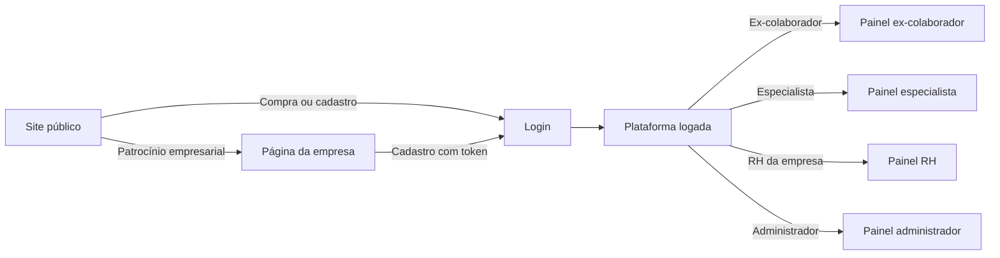

# Como a plataforma se organiza

## Para quem é

Quem precisa entender a divisão entre o que é público e o que exige login, sem entrar em detalhes de implementação.

## O que é

A Prepara.me funciona como **um site com duas grandes áreas**: uma aberta a qualquer visitante e outra restrita a usuários cadastrados. Ambas fazem parte da mesma experiência — o visitante conhece os serviços no site e, ao se cadastrar ou comprar, passa a usar a área logada.

## As duas grandes áreas

### Site público

É a vitrine da Prepara.me. Qualquer pessoa pode acessar sem criar conta.

**O que contém:**
- Página inicial com proposta de valor para empresas e ex-colaboradores
- Catálogo de mentorias e produtos (compra individual)
- Landing page do programa **Demissão Responsável** para empresas
- Kit Recolocação Pro
- Materiais educativos gratuitos
- Páginas institucionais (sobre nós, FAQ, termos de uso, privacidade)
- Páginas de **patrocínio** personalizadas por empresa parceira

**Quem usa:** visitantes, prospects B2B, ex-colaboradores em fase de descoberta, compradores avulsos.

### Plataforma logada

É a área que exige **login**. Após autenticação, o usuário vê um painel e menu adaptados ao seu perfil.

**O que contém:**
- Painel inicial personalizado por tipo de usuário
- Ferramentas do ex-colaborador (agenda, simulador, pesquisa, pedidos)
- Área do especialista (horários, entregas)
- Dashboard do RH da empresa (indicadores e pesquisas)
- Ferramentas de gestão do administrador (empresas, usuários, produtos, relatórios)

**Quem usa:** ex-colaboradores patrocinados ou compradores, especialistas de RH, gestores de RH das empresas parceiras, equipe interna da Prepara.me.

## Como as áreas se conectam

## Menu de navegação

### No site público

O menu principal está organizado em três blocos:

| Bloco | Itens |
|---|---|
| **Para você** | Mentorias individuais, Kit Recolocação Pro |
| **Para empresas** | Demissão responsável |
| **Sobre nós** | Nossa Empresa, Dúvidas Frequentes |

Há também acesso a **Login** e **Carrinho de compras** no cabeçalho.

### Na plataforma logada

O menu lateral muda completamente conforme o perfil do usuário. Cada perfil enxerga apenas o que lhe compete — veja detalhes em [Perfis de acesso](../02-quem-usa/perfis-de-acesso.md).

## O que o usuário vê e pode fazer

| Área | Sem login | Com login |
|---|---|---|
| Navegar páginas institucionais | Sim | Sim |
| Comprar mentorias | Sim (cadastro no checkout) | Sim |
| Acessar painel e ferramentas | Não | Sim |
| Responder pesquisa pós-demissão | Não | Sim (ex-colaborador) |
| Ver dashboard de RH | Não | Sim (RH da empresa) |
| Gerir empresas e usuários | Não | Sim (administrador) |

## Regras importantes

- Ao tentar acessar a plataforma logada sem estar autenticado, o sistema redireciona para a tela de **Login**
- Após o login, o usuário retorna automaticamente à página que tentava acessar
- O painel inicial muda de acordo com o perfil — não existe um painel único para todos

## Relacionado com

- [Mapa da plataforma](mapa-da-plataforma.md)
- [Visão geral do site](../03-site-publico/visao-geral-do-site.md)
- [Visão geral da plataforma logada](../04-plataforma-logada/visao-geral.md)
- [Perfis de acesso](../02-quem-usa/perfis-de-acesso.md)
