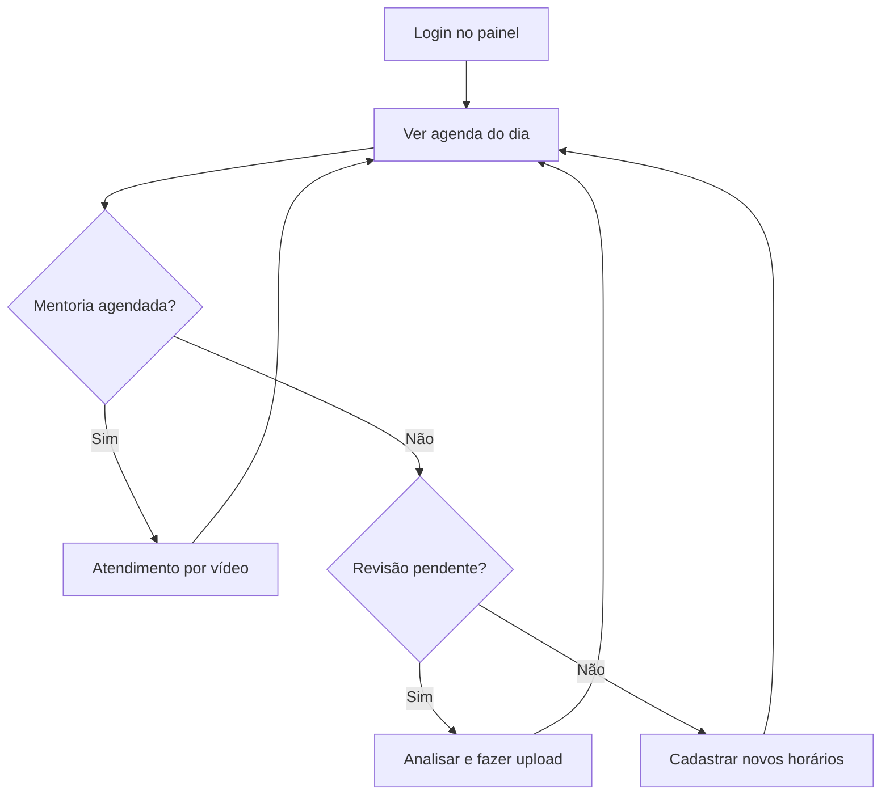

# Painel do especialista

## Para quem é

Consultores de RH cadastrados como especialistas na plataforma Prepara.me.

## O que é

O painel do especialista é a **tela inicial** após login (`/platform`). Foca na **agenda de atendimentos** — o especialista vê seus compromissos do dia e da semana, com informações sobre clientes e serviços.

## Onde encontrar

Após login → Painel inicial (`/platform`)

Menu lateral:
- Disponibilizar Horários
- Ver Produtos do Usuário
- Ver Objetivos dos Clientes (link externo)

## Componentes do painel

### Agenda de atendimentos
Visão central com:
- Mentorias agendadas por data e horário
- Informações do ex-colaborador atendido
- Tipo de serviço (mentoria, revisão, etc.)
- Status do atendimento

A agenda é o ponto de partida da rotina diária do especialista.

## Como funciona

1. Especialista faz login e vê a agenda
2. Consulta compromissos do dia
3. Para mentorias: realiza atendimento por vídeo no horário marcado
4. Para revisões: acessa "Ver Produtos do Usuário" para upload de entregas
5. Cadastra novos horários quando a agenda esvazia

## O que o usuário vê e pode fazer

| Ação | Onde |
|---|---|
| Ver agenda de atendimentos | Painel inicial |
| Cadastrar horários livres | Menu → Disponibilizar Horários |
| Ver serviços dos clientes | Menu → Ver Produtos do Usuário |
| Fazer upload de entregas | Ver Produtos do Usuário |
| Consultar objetivos dos clientes | Link externo (planilha) |
| Atualizar perfil | Cabeçalho → Meu perfil |

## Fluxo típico de um dia

## Regras importantes

- Especialista vê apenas **clientes e serviços atribuídos** a ele
- Prazo de entrega para revisões offline: **48 horas**
- Horários cadastrados ficam disponíveis para ex-colaboradores agendarem
- Link de objetivos dos clientes abre planilha externa (Google Sheets)

## Relacionado com

- [Especialista de RH](../02-quem-usa/especialista-de-rh.md)
- [Jornada do especialista](../07-jornadas/jornada-do-especialista.md)
- [Agendamentos e entregas](../09-gestao-operacional/agendamentos-e-entregas.md)
