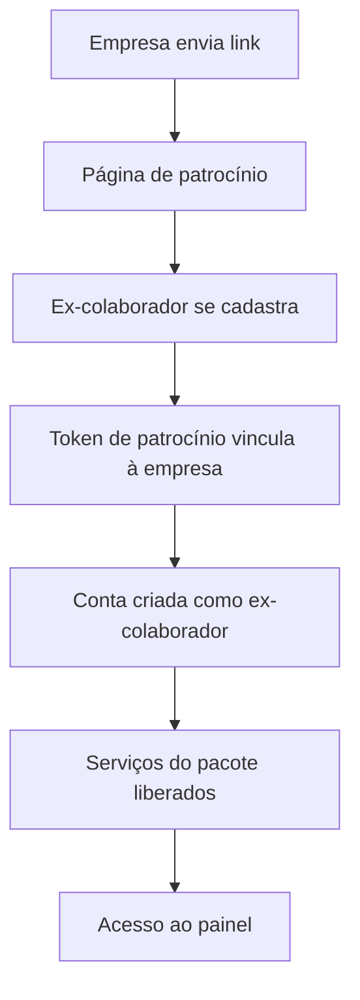

# Cadastro patrocinado

## Para quem é

Ex-colaboradores convidados por empresas parceiras e equipe que configura patrocínios.

## O que é

O **cadastro patrocinado** é o processo pelo qual ex-colaboradores de empresas parceiras criam conta na Prepara.me através da página de patrocínio, ficando automaticamente vinculados à empresa e com acesso aos serviços do pacote contratado.

## Onde encontrar

Link exclusivo: `/patrocinio/nome-da-empresa`

## Como funciona

### Passo a passo

1. **Empresa** comunica desligamento e envia link de patrocínio
2. **Ex-colaborador** acessa página com visual da empresa
3. Preenche cadastro: nome, e-mail, CPF, senha
4. Sistema associa conta à empresa via **token de patrocínio**
5. Serviços do pacote são atribuídos (automaticamente ou pelo admin)
6. Ex-colaborador acessa painel e inicia jornada de recolocação

## Elementos do vínculo

| Elemento | Função |
|---|---|
| Token de patrocínio | Identifica origem e empresa |
| Nome da empresa no cadastro | Registra vínculo com a empresa patrocinadora |
| Funcionário vinculado | Registro em lista de funcionários da empresa |

## O que o usuário vê e pode fazer

| Quem | Ação |
|---|---|
| Ex-colaborador | Cadastrar-se, login, usar serviços |
| Empresa | Enviar link (fora da plataforma) |
| Administrador | Configurar token, visual e serviços |

## Regras importantes

- Link é **exclusivo por empresa** — não transferível
- Cadastro cria perfil de **ex-colaborador** (não RH ou especialista)
- Token garante associação correta mesmo se ex-colaborador acessar link genérico depois
- Serviços dependem do que foi configurado no contrato/pacote

## Relacionado com

- [Página de patrocínio](../03-site-publico/pagina-de-patrocinio.md)
- [Jornada do ex-colaborador patrocinado](../07-jornadas/jornada-ex-colaborador-patrocinado.md)
- [Empresas e funcionários](../09-gestao-operacional/empresas-e-funcionarios.md)
- [Usuários e perfis](../09-gestao-operacional/usuarios-e-perfis.md)
