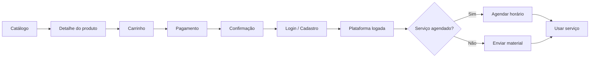

# Jornada de compra individual

## Para quem é

Pessoas físicas que contratam serviços diretamente pelo site, sem patrocínio empresarial.

## O que é

A **jornada de compra individual** descreve o caminho completo — do primeiro contato com o catálogo até o uso do serviço na plataforma logada.

## Fluxo completo

## Passo a passo

### 1. Descoberta
- Visitante acessa site → Menu **Para você** → Mentorias individuais
- Ou acessa Kit Recolocação Pro diretamente

### 2. Escolha
- Navega catálogo (`/ProductList`)
- Clica em serviço de interesse
- Lê descrição, preço e duração (`/ProductDetails`)

### 3. Carrinho
- Adiciona ao carrinho
- Pode adicionar múltiplos serviços
- Acessa carrinho (`/ShoppingCart`)

### 4. Pagamento
- Escolhe forma: **boleto** ou **cartão de crédito**
- Se não tem conta, faz cadastro no fluxo
- Confirma pagamento

### 5. Agendamento (se aplicável)
- Serviços agendados: redirecionado para escolha de horário (`/ProductSchedule`)
- Seleciona data e especialista disponível

### 6. Uso na plataforma
- Acessa painel logado
- Para mentorias: comparece no horário agendado
- Para revisões: envia currículo ou link do LinkedIn
- Acompanha status em **Meus Pedidos**

## O que o usuário vê em cada etapa

| Etapa | Página | Ações |
|---|---|---|
| Catálogo | `/ProductList` | Ver serviços, comparar |
| Detalhe | `/ProductDetails` | Ler descrição, adicionar ao carrinho |
| Agendamento | `/ProductSchedule` | Escolher horário |
| Carrinho | `/ShoppingCart` | Revisar, pagar |
| Plataforma | `/platform` | Usar serviços |

## Regras importantes

- Pagamento deve ser **confirmado** antes de liberar serviço
- Agendamento só após confirmação de pagamento
- Revisões: prazo de 48h após envio do material
- Kit Pro: cadastro pode ser feito na própria landing

## Relacionado com

- [Área Para você](../03-site-publico/area-para-voce.md)
- [Mentorias individuais](../05-produtos-e-servicos/mentorias-individuais.md)
- [Pagamentos](../09-gestao-operacional/pagamentos.md)
- [Kit Recolocação Pro](../05-produtos-e-servicos/kit-recolocacao-pro.md)
