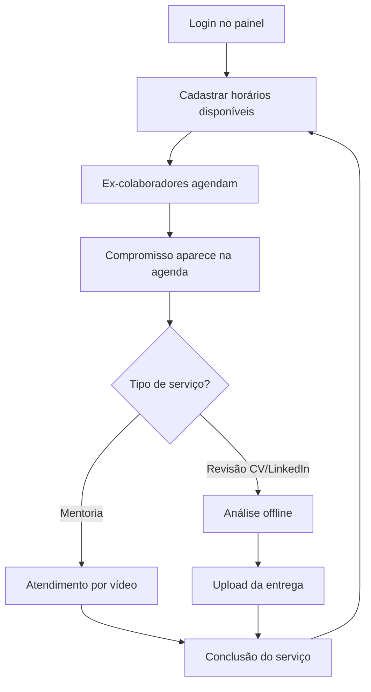

# Jornada do especialista

## Para quem é

Consultores de RH que prestam serviços na plataforma Prepara.me.

## O que é

A **jornada do especialista** descreve o ciclo completo de trabalho — desde o cadastro de horários até a entrega de serviços aos ex-colaboradores.

## Fluxo completo

## Passo a passo

### 1. Preparação
- Especialista faz login
- Acessa **Disponibilizar Horários**
- Cadastra dias e horários em que pode atender
- Horários ficam visíveis para ex-colaboradores agendarem

### 2. Agendamento
- Ex-colaborador escolhe horário disponível
- Compromisso aparece na agenda do especialista
- Especialista vê detalhes: nome do cliente, tipo de serviço, data/hora

### 3. Atendimento — mentorias
- No horário marcado, realiza mentoria por vídeo
- Orienta ex-colaborador sobre carreira, entrevistas, recolocação
- Finaliza atendimento

### 4. Atendimento — revisões
- Acessa **Ver Produtos do Usuário**
- Vê solicitações pendentes (currículo ou LinkedIn enviado)
- Analisa material offline
- Faz upload do resultado (CV reformulado ou PDF de orientações)
- Prazo: até **48 horas** após recebimento

### 5. Acompanhamento
- Consulta planilha de objetivos dos clientes (link externo)
- Verifica pendências em Ver Produtos do Usuário
- Cadastra novos horários conforme demanda

## O que o especialista faz em cada serviço

| Serviço | Ação principal | Prazo |
|---|---|---|
| Mentoria 1:1 | Vídeo no horário agendado | Data/hora marcada |
| Revisão de currículo | Análise + upload do CV reformulado | 48 horas |
| Análise LinkedIn | Análise + PDF com orientações | 48 horas |
| Mentoria coletiva | Conduz sessão em grupo | Data/hora da sessão |

## Regras importantes

- Especialista vê apenas **seus clientes e serviços**
- Nunca solicitar **senha do LinkedIn**
- Horários cadastrados determinam disponibilidade para agendamento
- Revisões adicionais solicitadas pelo cliente: novo prazo de 48h

## Relacionado com

- [Especialista de RH](../02-quem-usa/especialista-de-rh.md)
- [Painel do especialista](../04-plataforma-logada/painel-do-especialista.md)
- [Agendamentos e entregas](../09-gestao-operacional/agendamentos-e-entregas.md)
- [Revisão de currículo e LinkedIn](../05-produtos-e-servicos/revisao-de-curriculo-e-linkedin.md)
