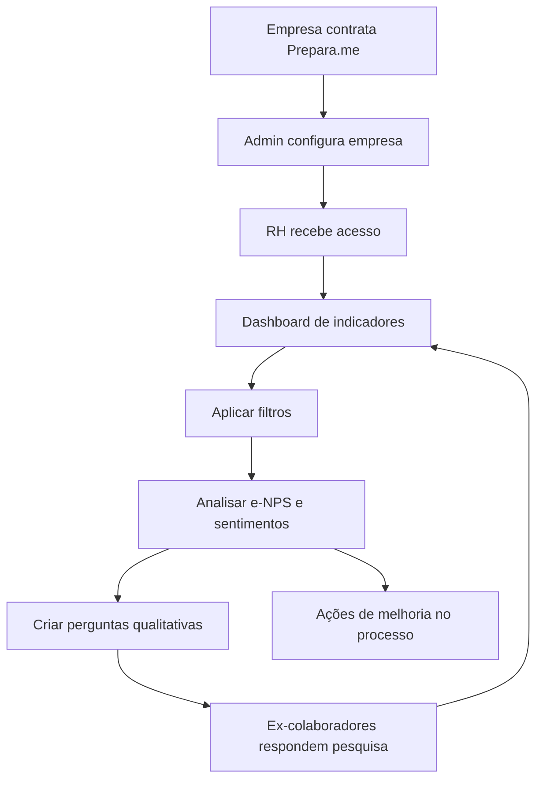

# Jornada do RH da empresa

## Para quem é

Gestores de RH de empresas parceiras que utilizam o programa de demissão responsável.

## O que é

A **jornada do RH da empresa** descreve como o gestor de RH utiliza a plataforma — desde o primeiro acesso ao dashboard até ações de melhoria baseadas em indicadores.

## Fluxo completo

## Passo a passo

### 1. Contratação e configuração
- Empresa contrata programa via contato comercial
- Administrador Prepara.me configura empresa (logo, cores, serviços)
- RH recebe credenciais de acesso (perfil administrador da empresa)

### 2. Primeiro acesso
- RH faz login e acessa dashboard
- Vê indicadores iniciais (podem estar vazios até haver respostas)

### 3. Configuração da pesquisa
- Acessa **Perguntas Qualitativas**
- Cria perguntas personalizadas para ex-colaboradores
- Perguntas aparecem na terceira etapa da pesquisa pós-demissão

### 4. Acompanhamento
- Ex-colaboradores respondem pesquisa após demissão
- Dashboard é atualizado com novos dados
- RH aplica filtros (período, unidade) para análise segmentada

### 5. Análise e ação
- Identifica padrões no mapa de sentimentos
- Monitora e-NPS e riscos (marca, trabalhista)
- Toma ações: ajuste no processo de demissão, comunicação, treinamentos

### 6. Gestão de funcionários
- Consulta lista de ex-colaboradores vinculados
- Verifica quem respondeu pesquisa e quem utilizou serviços

## Indicadores que o RH acompanha

| Indicador | O que revela |
|---|---|
| e-NPS | Satisfação geral com o processo |
| Mapa de sentimentos | Como ex-colaboradores se sentem |
| Risco de marca | Potencial dano à reputação empregadora |
| Risco trabalhista | Sinais de insatisfação que podem gerar conflitos |

## Regras importantes

- RH vê dados **apenas da própria empresa**
- Indicadores dependem de **respostas dos ex-colaboradores**
- Quanto mais respostas, mais confiável a análise
- Perguntas qualitativas são opcionais mas recomendadas

## Relacionado com

- [Administrador da empresa](../02-quem-usa/administrador-da-empresa.md)
- [Painel do RH da empresa](../04-plataforma-logada/painel-do-rh-empresa.md)
- [Dashboard do RH](../08-pesquisas-e-indicadores/dashboard-do-rh.md)
- [Programa para empresas](../06-demissao-responsavel/programa-para-empresas.md)
