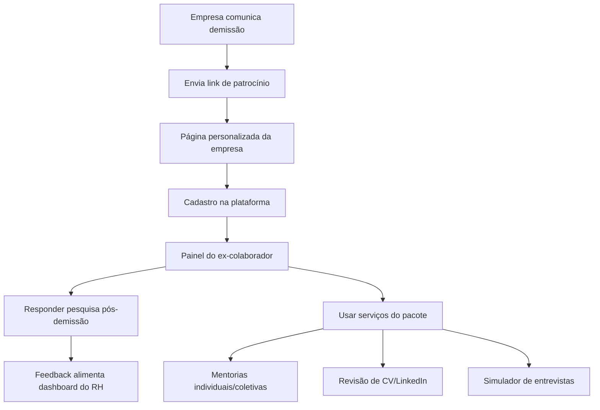

# Jornada do ex-colaborador patrocinado

## Para quem é

Ex-colaboradores de empresas parceiras e equipes que acompanham a experiência pós-demissão.

## O que é

A **jornada do ex-colaborador patrocinado** descreve o caminho desde o convite da empresa até a utilização completa dos serviços de recolocação na plataforma.

## Fluxo completo

## Passo a passo

### Fase 1 — Convite
1. Empresa realiza desligamento
2. Comunica sobre apoio Prepara.me
3. Envia link exclusivo `/patrocinio/nome-da-empresa`

### Fase 2 — Cadastro
4. Ex-colaborador acessa página com logo da empresa
5. Cria conta (nome, e-mail, CPF, senha)
6. Sistema vincula à empresa via token de patrocínio

### Fase 3 — Acolhimento
7. Entra no painel com mensagem de boas-vindas
8. Vê serviços disponíveis no pacote
9. Recebe convite para pesquisa pós-demissão

### Fase 4 — Feedback
10. Responde pesquisa (NPS → sentimentos → perguntas da empresa)
11. Respostas alimentam dashboard do RH

### Fase 5 — Recolocação
12. Agenda mentorias (se incluídas)
13. Envia currículo para revisão (se incluída)
14. Pratica no simulador (se incluído)
15. Participa de mentorias coletivas (se disponíveis)
16. Acompanha progresso no painel e Meus Pedidos

## Momentos-chave da experiência

| Momento | O que acontece | Importância |
|---|---|---|
| Primeiro acesso | Boas-vindas personalizada | Acolhimento emocional |
| Pesquisa | Expressão de sentimentos | Feedback para RH e Prepara.me |
| Primeira mentoria | Contato com especialista | Orientação prática |
| Entrega de CV | Resultado tangível | Preparação para mercado |
| Simulador | Prática de entrevista | Confiança para processos seletivos |

## Regras importantes

- Serviços dependem do **pacote contratado** pela empresa
- Pesquisa é **única** — não pode ser refeita
- Plano de aposentadoria altera experiência (sem pesquisa)
- Ex-colaborador pode continuar comprando serviços adicionais pelo site

## Relacionado com

- [Cadastro patrocinado](../06-demissao-responsavel/cadastro-patrocinado.md)
- [Apoio ao ex-colaborador](../06-demissao-responsavel/apoio-ao-ex-colaborador.md)
- [Painel do ex-colaborador](../04-plataforma-logada/painel-do-ex-colaborador.md)
- [Jornada pós-demissão — pesquisa](jornada-pos-demissao-pesquisa.md)
