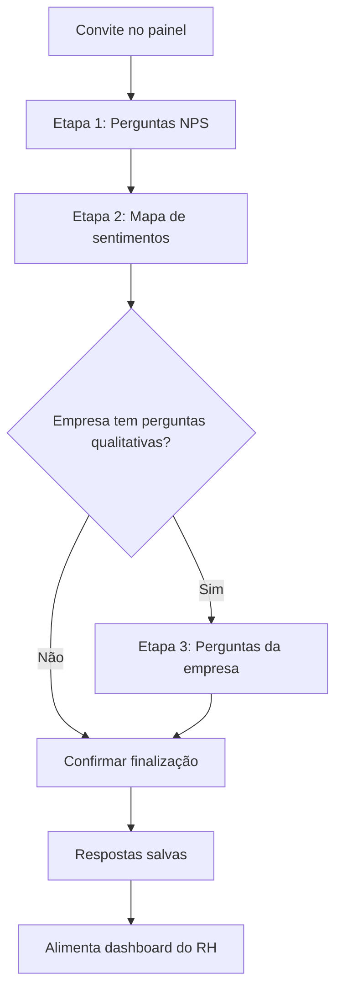

# Jornada pós-demissão — pesquisa

## Para quem é

Ex-colaboradores que devem responder a pesquisa e equipes de RH que utilizam os resultados.

## O que é

A **pesquisa pós-demissão** é um fluxo de três etapas que coleta feedback dos ex-colaboradores sobre a experiência de demissão. Alimenta indicadores do dashboard de RH e ajuda empresas a melhorar seus processos.

## Fluxo completo

## Passo a passo

### Etapa 1 — Perguntas NPS
- Ex-colaborador responde perguntas de satisfação (escala NPS)
- Deve responder **todas** as perguntas para avançar
- Avalia experiência geral com a demissão e apoio recebido

### Etapa 2 — Mapa de sentimentos
- Seleciona um ou mais sentimentos que descrevem como se sente
- Opções incluem: alívio, surpresa, injustiça, raiva, urgência, insegurança, tristeza, indiferença
- Deve selecionar **ao menos um** sentimento

### Etapa 3 — Perguntas da empresa (quando existem)
- RH da empresa pode ter configurado perguntas personalizadas
- Ex-colaborador responde perguntas qualitativas específicas
- Só aparece se a empresa tiver perguntas cadastradas

### Finalização
- Sistema pede confirmação: após finalizar, **não é possível refazer**
- Respostas são salvas e processadas nos indicadores

## Onde encontrar

- Painel do ex-colaborador → card de convite
- Ou diretamente em `/survey`

## Regras importantes

| Regra | Detalhe |
|---|---|
| Unicidade | Pesquisa respondida **uma única vez** |
| Obrigatoriedade | Todas perguntas NPS devem ser respondidas |
| Sentimentos | Ao menos **um** sentimento selecionado |
| Plano aposentadoria | Pesquisa **não aparece** |
| Confirmação | Finalização é **irreversível** |

## Relacionado com

- [Pesquisa pós-demissão](../08-pesquisas-e-indicadores/pesquisa-pos-demissao.md)
- [Mapa de sentimentos](../08-pesquisas-e-indicadores/mapa-de-sentimentos.md)
- [Dashboard do RH](../08-pesquisas-e-indicadores/dashboard-do-rh.md)
- [Jornada do ex-colaborador patrocinado](jornada-ex-colaborador-patrocinado.md)
