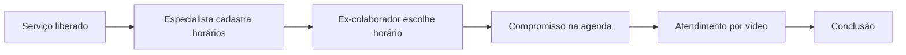
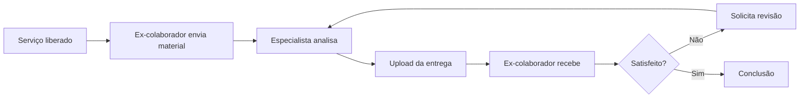

# Agendamentos e entregas

## Para quem é

Ex-colaboradores que agendam serviços, especialistas que entregam e administradores que acompanham.

## O que é

**Agendamentos e entregas** descreve como serviços agendados (mentorias) e não agendados (revisões) fluem desde a contratação até a conclusão.

## Tipos de fluxo

### Serviços agendados (mentorias)

### Serviços não agendados (revisões)

## Onde cada perfil atua

| Perfil | Página | Ação |
|---|---|---|
| Especialista | Disponibilizar Horários | Cadastrar horários livres |
| Ex-colaborador | Painel → Agenda | Agendar mentoria |
| Especialista | Ver Produtos do Usuário | Upload de entregas |
| Ex-colaborador | Meus Pedidos | Acompanhar status |
| Administrador | Ver Produtos do Usuário | Monitorar todas entregas |

## Ver Produtos do Usuário

Tela central para acompanhamento de serviços (`/viewProductsUser` — admin e especialista).

Busca colaboradores no **cadastro RH**; produtos e arquivos vêm da **conta** (`userId`) vinculada a esse colaborador.

| Informação | Descrição |
|---|---|
| Cliente (RH) | Nome/CPF/empresa do colaborador |
| Serviço | Tipo de produto (mentoria, revisão, etc.) |
| Status arquivo | Pendências de currículo/relatório quando há agendamento |
| Arquivos | Uploads do cliente e do especialista (só em linhas com agendamento) |

### Comportamentos operacionais (fix 2026-08)

- Se o CPF do RH for diferente do CPF da conta vinculada, a tela mostra um **aviso** — produtos continuam sendo os da conta (`userId`). Corrigir o vínculo no cadastro RH.
- Produtos **cancelados** não aparecem na lista.
- Se a foto do especialista não carregar, a tela mostra o **nome**.

Detalhe técnico: [CORR Ver Produtos userId](../desenvolvimento/correcoes/2026-08-04-view-products-user-userid.md).

### Fluxo de arquivos
- **Ex-colaborador** envia currículo ou link do LinkedIn
- **Especialista** faz upload do resultado (CV reformulado ou PDF)
- Ambos podem acompanhar histórico de arquivos

## Regras importantes

| Regra | Detalhe |
|---|---|
| Horários | Só horários cadastrados pelo especialista ficam disponíveis |
| Prazo revisão | Até **48 horas** após recebimento do material |
| Revisão adicional | Nova entrega em até **48 horas** |
| LinkedIn | Apenas link do perfil — nunca senha |
| Agenda | Mentorias individuais e coletivas aparecem juntas |

## Relacionado com

- [Mentorias individuais](../05-produtos-e-servicos/mentorias-individuais.md)
- [Revisão de currículo e LinkedIn](../05-produtos-e-servicos/revisao-de-curriculo-e-linkedin.md)
- [Jornada do especialista](../07-jornadas/jornada-do-especialista.md)
- [Especialista de RH](../02-quem-usa/especialista-de-rh.md)
