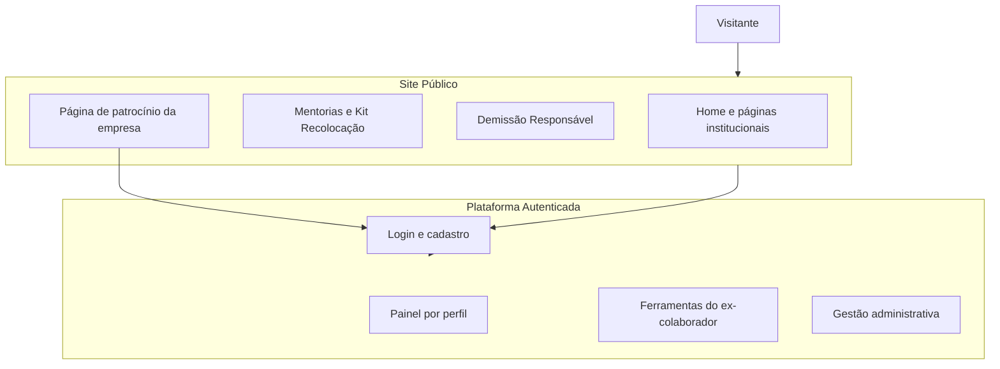

# Documentação Prepara.me

Bem-vindo à documentação da plataforma **Prepara.me | Demissão Responsável**.

Esta pasta reúne tudo o que você precisa saber para entender como a plataforma funciona — o que ela oferece, quem usa cada parte e como os fluxos se conectam. A documentação foi escrita em linguagem acessível, pensada para times de produto, operação, suporte e parceiros de RH, sem necessidade de conhecimento técnico.

> **Desenvolvimento:** para agentes de IA, skills Cursor e arquitetura técnica do frontend, veja [`desenvolvimento/`](desenvolvimento/README.md) e [`AGENTS.md`](../AGENTS.md) na raiz.

## O que é a Prepara.me

A Prepara.me apoia empresas e ex-colaboradores no processo de **demissão responsável** e **recolocação profissional**. A plataforma combina um site público (institucional e loja de serviços) com uma área logada onde cada perfil de usuário acessa ferramentas específicas: mentorias, revisão de currículo, simulador de entrevistas, pesquisas pós-demissão e dashboards para RH.

## Como a plataforma se organiza

## Por onde começar

Escolha o caminho que melhor se encaixa no seu papel:

| Se você é... | Comece por |
|---|---|
| Novo no time ou quer visão geral | [O que é a plataforma](01-visao-geral/o-que-e-a-plataforma.md) |
| Ex-colaborador ou time de suporte ao usuário | [Ex-colaborador](02-quem-usa/ex-colaborador.md) → [Painel do ex-colaborador](04-plataforma-logada/painel-do-ex-colaborador.md) |
| Especialista de RH da Prepara.me | [Especialista de RH](02-quem-usa/especialista-de-rh.md) → [Jornada do especialista](07-jornadas/jornada-do-especialista.md) |
| RH de empresa parceira | [Administrador da empresa](02-quem-usa/administrador-da-empresa.md) → [Dashboard do RH](08-pesquisas-e-indicadores/dashboard-do-rh.md) |
| Time interno / operação | [Administrador da plataforma](02-quem-usa/administrador-da-plataforma.md) → [Gestão operacional](09-gestao-operacional/) |

## Índice completo

### 01 — Visão geral
- [O que é a plataforma](01-visao-geral/o-que-e-a-plataforma.md)
- [Como a plataforma se organiza](01-visao-geral/como-a-plataforma-se-organiza.md)
- [Mapa da plataforma](01-visao-geral/mapa-da-plataforma.md)

### 02 — Quem usa
- [Perfis de acesso](02-quem-usa/perfis-de-acesso.md)
- [Ex-colaborador](02-quem-usa/ex-colaborador.md)
- [Especialista de RH](02-quem-usa/especialista-de-rh.md)
- [Administrador da empresa](02-quem-usa/administrador-da-empresa.md)
- [Administrador da plataforma](02-quem-usa/administrador-da-plataforma.md)

### 03 — Site público
- [Visão geral do site](03-site-publico/visao-geral-do-site.md)
- [Página inicial e institucional](03-site-publico/pagina-inicial-e-institutional.md)
- [Área Para você](03-site-publico/area-para-voce.md)
- [Demissão responsável](03-site-publico/demissao-responsavel.md)
- [Materiais gratuitos](03-site-publico/materiais-gratuitos.md)
- [Página de patrocínio](03-site-publico/pagina-de-patrocinio.md)

### 04 — Plataforma logada
- [Visão geral](04-plataforma-logada/visao-geral.md)
- [Painel do ex-colaborador](04-plataforma-logada/painel-do-ex-colaborador.md)
- [Painel do especialista](04-plataforma-logada/painel-do-especialista.md)
- [Painel do RH da empresa](04-plataforma-logada/painel-do-rh-empresa.md)
- [Painel do administrador](04-plataforma-logada/painel-do-administrador.md)

### 05 — Produtos e serviços
- [Catálogo de serviços](05-produtos-e-servicos/catalogo-de-servicos.md)
- [Mentorias individuais](05-produtos-e-servicos/mentorias-individuais.md)
- [Revisão de currículo e LinkedIn](05-produtos-e-servicos/revisao-de-curriculo-e-linkedin.md)
- [Simulador de entrevistas](05-produtos-e-servicos/simulador-de-entrevistas.md)
- [Kit Recolocação Pro](05-produtos-e-servicos/kit-recolocacao-pro.md)
- [Mentorias coletivas](05-produtos-e-servicos/mentorias-coletivas.md)
- [Construtor de currículo](05-produtos-e-servicos/construtor-de-curriculo.md)
- [Planos e assinaturas](05-produtos-e-servicos/planos-e-assinaturas.md)

### 06 — Demissão responsável
- [Programa para empresas](06-demissao-responsavel/programa-para-empresas.md)
- [Apoio ao ex-colaborador](06-demissao-responsavel/apoio-ao-ex-colaborador.md)
- [Cadastro patrocinado](06-demissao-responsavel/cadastro-patrocinado.md)
- [Mentoria gratuita para empresas](06-demissao-responsavel/mentoria-gratuita-para-empresas.md)

### 07 — Jornadas
- [Jornada de compra individual](07-jornadas/jornada-compra-individual.md)
- [Jornada do ex-colaborador patrocinado](07-jornadas/jornada-ex-colaborador-patrocinado.md)
- [Jornada pós-demissão — pesquisa](07-jornadas/jornada-pos-demissao-pesquisa.md)
- [Jornada do especialista](07-jornadas/jornada-do-especialista.md)
- [Jornada do RH da empresa](07-jornadas/jornada-do-rh-empresa.md)

### 08 — Pesquisas e indicadores
- [Pesquisa pós-demissão](08-pesquisas-e-indicadores/pesquisa-pos-demissao.md)
- [Mapa de sentimentos](08-pesquisas-e-indicadores/mapa-de-sentimentos.md)
- [Dashboard do RH](08-pesquisas-e-indicadores/dashboard-do-rh.md)
- [Relatório de recolocação](08-pesquisas-e-indicadores/relatorio-de-recolocacao.md)

### 09 — Gestão operacional
- [Empresas e funcionários](09-gestao-operacional/empresas-e-funcionarios.md)
- [Usuários e perfis](09-gestao-operacional/usuarios-e-perfis.md)
- [Produtos e pedidos](09-gestao-operacional/produtos-e-pedidos.md)
- [Agendamentos e entregas](09-gestao-operacional/agendamentos-e-entregas.md)
- [Materiais educativos](09-gestao-operacional/materiais-educativos.md)
- [Pagamentos](09-gestao-operacional/pagamentos.md)

### 10 — Glossário
- [Termos e conceitos](10-glossario/termos-e-conceitos.md)
