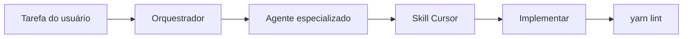

# Desenvolvimento — Prepara.me Frontend

Documentação técnica e catálogo de **agentes de desenvolvimento** para quem implementa features neste repositório.

> Para entender o **produto** (o que a plataforma faz), use [`docs/`](../README.md).  
> Esta pasta é para **como desenvolver** no frontend.

## Índice

| Documento | Conteúdo |
|---|---|
| [Arquitetura frontend](arquitetura-frontend.md) | Stack, pastas `src/`, padrões globais |
| [Especificações](especificacoes/) | SPEC + design de features (feat/fix) |
| [Changelog (raiz)](../../CHANGELOG.md) | Histórico de mudanças do frontend |
| [Agentes](agents/README.md) | Personas — orquestrador, novas demandas, especialistas |
| [Demandas](demandas/README.md) | Registro de features em andamento |
| [Futuro](futuro/README.md) | Planos guardados para implementação posterior |
| [Skills](skills/README.md) | Skills Cursor e inventário |

## Agentes disponíveis

| Agente | Skill principal | Automático? |
|---|---|---|
| **[Orquestrador](agents/orquestrador.md)** | `preparame-orquestrador` | Tarefas especificadas |
| **[Novas demandas](agents/novas-demandas.md)** | `preparame-novas-demandas` | **Features novas — fluxo completo** |
| [Site público](agents/site-publico.md) | `preparame-site-publico` | Via orquestrador |
| [Plataforma CRUD](agents/plataforma-crud.md) | `preparame-crud-admin` | Via orquestrador |
| [Auth e rotas](agents/autenticacao-rotas.md) | `preparame-router-auth` | Via orquestrador |
| [Ex-colaborador](agents/ex-colaborador.md) | `preparame-ex-colaborador` | Via orquestrador |
| [Pesquisas e relatórios](agents/pesquisas-relatorios.md) | `preparame-nps-relatorios` | Via orquestrador |
| [Integrações](agents/integracoes.md) | `preparame-pagamentos-pedidos` | Via orquestrador |

## Fluxo (automático)

Você **não precisa** escolher agente — descreva a tarefa e o orquestrador roteia.

## Skills Cursor

Implementadas em [`.cursor/skills/`](../../.cursor/skills/). Ver [inventário completo](skills/inventario-skills.md).

## Entrada rápida para IA

Ver também [`AGENTS.md`](../../AGENTS.md) na raiz do repositório.
