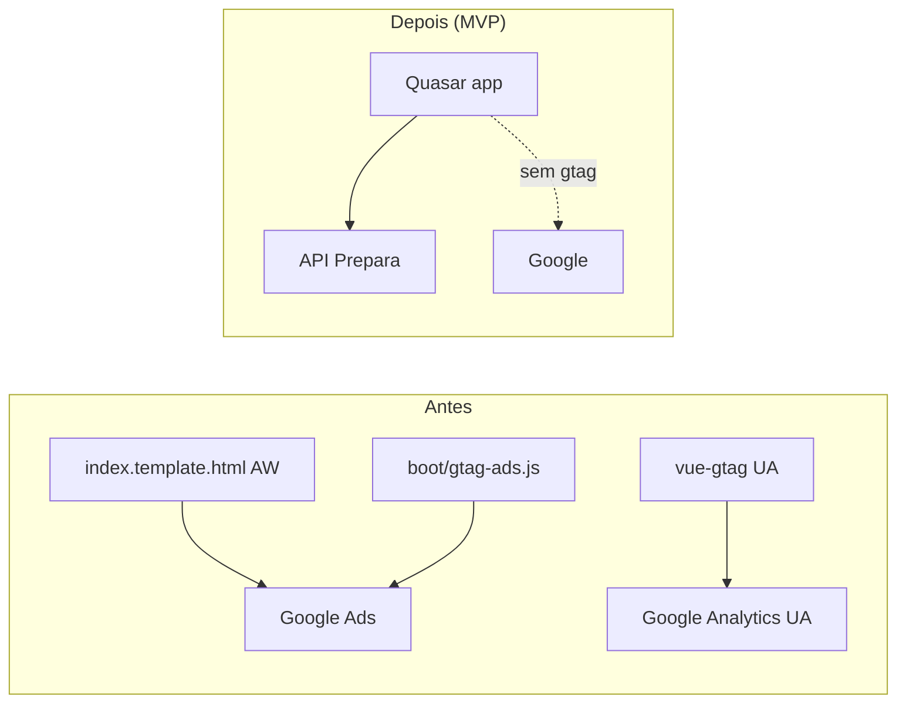

# Design — Remover rastreadores Google do app.prepara.me

| Campo | Valor |
|-------|-------|
| CORR | CORR-2026-08-04-REMOVE-GOOGLE-TRACKERS |
| Branch | `fix/remove-google-trackers` |
| Data | 2026-08-04 |
| Status | aprovado / implementado |

## 1. Contexto e objetivos

- **Problema:** o frontend do app injeta Google Analytics (`UA-151306939-1`) e Google Ads (`AW-304198855`) em todas as páginas, misturando métricas com o site.
- **Meta:** remover 100% do wiring Google do app nesta entrega; novo ID exclusivo do app fica para feat futura.
- **NFR:** sem regressão de navegação/login; bundle sem requests a `googletagmanager` / gtag; lint ok.

## 2. Recomendacao e alternativas

### Recomendada — remoção total dos pontos de injeção

Apagar boot + scripts HTML + plugin vue-gtag + dependência npm.

**Por quê:** elimina causa raiz; zero risco de “env esquecido” reativar ID antigo; alinhado ao pedido.

### Alternativa descartada — feature flag / env

Manter código e desligar por `VUE_APP_ENABLE_GTAG=false`.

**Trade-off:** código morto com IDs do site; fácil reativar o errado; não cumpre “tirar”.

## 3. Visao de sistema

Fronteira: **somente** `preparame-platform`. Backend e site institucional **fora**.

## 4. Componentes e responsabilidades

| Componente | Faz | Não faz |
|------------|-----|---------|
| `quasar.conf.js` | Deixa de carregar boot `gtag-ads` | Não configura novo analytics |
| `src/boot/gtag-ads.js` | **Removido** | — |
| `src/index.template.html` | Remove bloco script gtag Ads | Mantém DPO + VLibras |
| `src/router/index.js` | Remove `VueGtag` / import | Mantém guards de rota |
| `package.json` | Remove `vue-gtag` | Não adiciona GA4 |

## 5. Modelo de dados

N/A — sem persistência.

## 6. Fluxos principais

1. **Boot do app:** Quasar sobe sem boot gtag → sem `window.gtag` Ads.
2. **Primeiro HTML:** sem script `googletagmanager.com/gtag/js?id=AW-...`.
3. **Navegação SPA:** router sem vue-gtag → sem page_view UA.
4. **Futuro (fora):** feat com ID próprio via env + boot mínimo.

## 7. API / contratos

N/A.

## 8. Infra

N/A (sem Compose/env novos). Deploy normal do front após merge.

## 9. Estrutura / branch

- Branch: `fix/remove-google-trackers` (já aberta a partir de `gitlab/main`)
- Docs: CORR + este design em `docs/desenvolvimento/correcoes/`
- CHANGELOG Fixed na fase de docs/dev

## 10. MVPs

| MVP | Escopo |
|-----|--------|
| **MVP-1 (esta entrega)** | Remover UA + AW + vue-gtag + boot; V-01…V-04 |
| MVP-2 (futuro) | Introduzir GA4/GTM **só do app** com ID novo e env |

## 11. Riscos e decisoes abertas

| Risco | Mitigação |
|-------|-----------|
| Cache de HTML antigo em CDN | Deploy + validação Network (V-02) |
| Marketing perde conversões do app | Aceito; MVP-2 |
| `package-lock` desalinhado | `npm uninstall vue-gtag` ou editar + install |

**Dúvidas:** nenhuma bloqueante — escopo confirmado na CORR.

## 12. Plano de implementacao

1. Remover `gtag-ads` do `boot` em `quasar.conf.js`; deletar `src/boot/gtag-ads.js`.
2. Limpar scripts Google em `index.template.html`.
3. Remover VueGtag em `router/index.js`.
4. Remover dep `vue-gtag` (`package.json` / lock).
5. Grep de sanidade (V-01); lint (V-04); smoke Network (V-02/V-03).
6. Docs: CHANGELOG + nota curta no README se houver menção a analytics.
