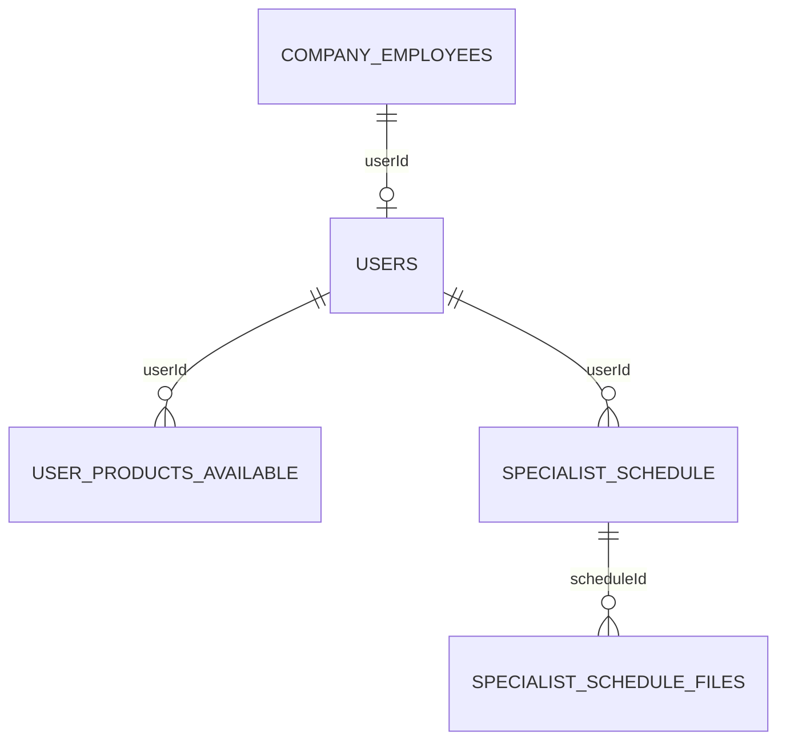
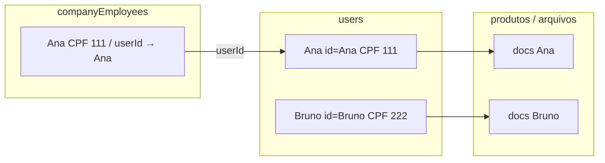
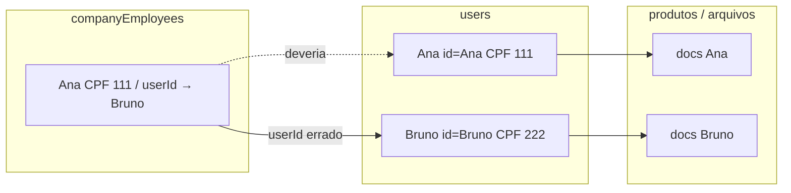

# CORR — Ver Produtos do Usuário: dados/arquivos de outra conta

## 1. Identificacao

| Campo | Valor |
|-------|-------|
| Tipo | **fix** |
| Codigo | CORR-2026-08-04-VIEW-PRODUCTS-USER |
| Titulo | Especialista vê produtos/arquivos de outro usuário em Ver Produtos do Usuário |
| Branch | `fix/view-products-user-userid` (platform) |
| Severidade | **alta** (dados pessoais / documentos de terceiros na operação) |
| Ambiente | prod / homolog (relatado em uso operacional) |
| Status | verificado (docs fase 7) |
| Data do incidente | 2026-08-04 (relato) |
| Data deste documento | 2026-08-04 |
| Relator | Operação / especialista Prepara.me |

## 2. Sintoma (o que o usuario / sistema viu)

Especialista (ou admin) em **Ver Produtos do Usuário** consulta uma pessoa e vê **dados/documentos de outras pessoas**.

- Mensagem de erro / HTTP: N/A (comportamento silencioso / dados trocados)
- Onde: tela `/viewProductsUser` (menu Especialista e Admin → Consultas)
- Frequencia / desde quando: observado em 2026-08-04; casos citados: **Camila Mendes Borba**, **Lucas Michael**, **Tabitha** — “docs trocados, um com doc do outro”
- Relato adicional: menu “Ver Produtos do Usuário” no admin/especialista (já existia; não foi inventado nesta data)

## 3. Evidencias (fatos)

| # | Tipo | Evidencia (fato) | Fonte |
|---|------|------------------|-------|
| 1 | relato | Três pessoas com documentos/dados cruzados na consulta de produtos | Conversa operacional 2026-08-04 |
| 2 | codigo | Tela reescrita no PR LinkedIn: busca `companies/employees` e exibe `ce.name` / `ce.documentId`; produtos via `employee.user.id` | `61d2155` / PR #11 platform — `ViewProductsUser.vue` |
| 3 | codigo | Antes: seleção de **usuário** (`users` / DialogSelect) e lista por `userId` direto | `ViewProductsUser.vue` pré-`61d2155` |
| 4 | codigo | API de produtos filtra apenas por `userId` (`listProductByUserWithSpecialist`) | backend `ListProductByUserWithSpecialistUseCase` / `ProductsRepository.findByUserIdWithSpecialist` |
| 5 | codigo | `loadProducts()` sem cancelamento/sequência: resposta atrasada de outro colaborador pode sobrescrever a lista | `ViewProductsUser.vue` (estado atual em `main`) |
| 6 | codigo | `ViewFileDialog` sem `identifier` obrigatório na tela (prop required) | `ViewProductsUser.vue` + `ViewFileDialog.vue` |
| 7 | git | Menu “Ver Produtos do Usuário” já existia (ADMIN Consultas + SPECIALIST) desde jun/2026 | `menuConfig.js` |

## 4. Linha do tempo (entendimento fiel)

| Quando | O que ocorreu | Evidencia # |
|--------|---------------|-------------|
| ~2026-06 | Menu Ver Produtos do Usuário disponível a admin/especialista | 7 |
| Histórico | Fluxo antigo: escolher **usuário** → produtos desse `userId` | 3 |
| 2026-07-12 | PR LinkedIn reescreve a tela: busca **colaborador RH** → mostra CPF/nome do employee → produtos pelo `user` ligado | 2, 3 |
| 2026-08-04 | Especialista reporta docs/dados cruzados entre Camila / Lucas / Tabitha | 1 |
| 2026-08-04 | RCA em sessão: descasamento employee↔user + race em `loadProducts` | 2–6 |

## 5. Impacto

- Quem/o que foi afetado: especialistas/admins na consulta; risco de **ver/baixar arquivos de outro cliente**
- Dados corrompidos / perda / bloqueio: não implica corrupção automática no banco; **exposição/confusão operacional** de documentos; vínculo `companyEmployees.userId` inconsistente (se existir) permanece até correção cadastral
- Trabalho interrompido: sim (confiança na tela comprometida)

## 6. Causa raiz

### 6.1 Causa raiz (afirmacao)

A tela passou a mostrar a **identidade do colaborador RH** (`companyEmployees`) e a carregar produtos/arquivos pela **conta** (`userId`), sem deixar explícito o vínculo nem proteger contra (a) inconsistência `employee ↔ user` e (b) **condição de corrida** ao trocar de pessoa rapidamente.

### 6.2 Cadeia causal

`Rewrite LinkedIn (busca employee) → UI mostra CPF/nome do RH enquanto produtos vêm do userId → se userId aponta para outra conta OU race sobrescreve lista → especialista vê docs/dados “trocados”`

### 6.2.1 Relação de tabelas — certa vs errada



**Certa** — ficha RH e conta batem:



**Errada** — ficha Ana, seta para Bruno → “docs trocados”:



O fix de tela **não** altera o FK no banco: deixa a conta explícita, alerta mismatch e elimina race. Limpeza de `userId` permanece correção cadastral.

### 6.3 O que **nao** e a causa (descartes)

| Hipotese descartada | Por que descartou (evidencia) |
|---------------------|-------------------------------|
| Menu novo “Ver Produtos” criado hoje | Menu já existia (#7); só a implementação da tela mudou no LinkedIn |
| PATCH LinkedIn troca `userId`/CPF | Use case só atualiza `linkedinUrl` / flag OTW |
| Feat RH quantitativa/OTW de 2026-08-04 | Não altera `ViewProductsUser` (fora de escopo daquele WIP; RCA apontou PR #11) |
| “Corrigir” buscando produtos por CPF | Produtos são da **conta** (`userId`); CPF é atributo, não chave de produto (#4) |

### 6.4 Confianca

| Nivel | Condicao |
|-------|----------|
| Alta | Reproduzido ou comprovado por evidencia direta |
| Media | Evidencia forte, reproducao parcial |
| Baixa | Inferencia — **nao corrigir em definitivo ate elevar** |

Nivel deste caso: **Alta (repro local)** — fixture controlado `[REPRO]` no Postgres local + código comprova race; Camila no banco local está com vínculo CPF consistente (caso operacional pode ser race ou dado de outro ambiente).

## 6.5 Como reproduzir (antes do fix) — fixture local

Script: `docs/desenvolvimento/correcoes/repro-view-products-user.sql` (já aplicado no `database_preparame` local em 2026-08-04).

Front: `http://localhost:8081` → menu **Ver Produtos do Usuário** (admin ou especialista). Código ainda **sem** o fix.

| Caso | Busca | O que a tela mostra hoje (bug) | O que deveria ficar claro após o fix |
|------|-------|--------------------------------|--------------------------------------|
| **A — vínculo errado** | Nome `[REPRO] Ana` ou CPF `11111111111` | Ficha **Ana** (CPF 111…); produtos de **Bruno** (Currículo PT + LinkedIn) | Banner: conta usada = Bruno / CPF 222…; produtos continuam por `userId` |
| **B — controle** | Nome `[REPRO] Bruno` ou CPF `22222222222` | Ficha Bruno; mesmos produtos de Bruno | Sem banner (CPF bate) |
| **C — outro mismatch** | Nome `[REPRO] Carla` ou CPF `33333333333` | Ficha Carla (333…); produto **Simulação de Entrevista** da conta Ana | Banner: conta = Ana / CPF 111… |
| **D — race** | Buscar `REPRO`, selecionar **Ana**, em seguida **Carla** bem rápido (antes de carregar) | Lista pode ficar com produtos da pessoa anterior | Lista final = última pessoa (Carla → produto Ana) |

Limpeza (quando terminar os testes):

```sql
DELETE FROM "specialistSchedule" WHERE comments LIKE 'REPRO fixture%';
DELETE FROM "userProductsAvailable" WHERE "userId" IN (
  SELECT id FROM users WHERE email LIKE 'repro.viewproducts.%@prepara.local');
DELETE FROM "companyEmployees" WHERE email LIKE 'repro.viewproducts.%@prepara.local';
DELETE FROM users WHERE email LIKE 'repro.viewproducts.%@prepara.local';
```

Dado real já no banco (sem fixture): colaborador **Jéssika Marcelly Fernandes Silva** — CPF RH ≠ CPF da conta vinculada, com produtos/agendamentos na conta. Útil como segundo check; não altera cadastro.

## 7. Correcao proposta

### 7.1 Mudanca

Em `ViewProductsUser.vue` (platform):

1. **Fonte de verdade dos produtos:** sempre `userId` = `employee.user.id` (ou `employee.userId` se existir no DTO).
2. **Transparência:** exibir na UI a **conta usada** (nome/CPF/`userId` do `user` vinculado), distinta do cadastro RH.
3. **Alerta:** se CPF RH ≠ CPF da conta vinculada (normalizado), banner de inconsistência — **sem** trocar a busca para CPF.
4. **Race guard:** incrementar request id em `loadProducts` / `selectEmployee`; ignorar respostas atrasadas.
5. **ViewFileDialog:** passar `identifier` obrigatório.
6. Sem alteração de API obrigatória neste MVP (produtos já filtram por `userId`).

Backend: **N/A** neste MVP (salvo necessidade futura de expor `userId` top-level no DTO employee — opcional).

Observabilidade Node (`@clamed/logger` / `light-node-metrics`): **N/A** — correção só no frontend Vue/Quasar.

### 7.2 Justificativa

Elimina a ambiguidade de identidade (RH vs conta), impede sobrescrita por race e evita “adivinhar” conta por CPF — alinhado ao modelo de dados (produtos/arquivos pertencem ao `users.id`).

### 7.3 Alternativas consideradas

| Alternativa | Por que nao foi escolhida |
|-------------|---------------------------|
| Resolver produtos por CPF do colaborador | Produtos são por `userId`; mascara erro de vínculo e pode apontar conta errada |
| Voltar 100% ao DialogSelect de users | Perde busca por CPF/empresa/LinkedIn da tela atual; regressão de UX do LinkedIn |
| Só corrigir dados no banco | Necessário quando o FK está errado, mas não resolve race nem UX opaca |

### 7.4 Riscos da correcao

| Risco | Mitigacao |
|-------|-----------|
| Colaborador sem `user` / `userId` | Lista vazia + aviso claro; sem inventar conta |
| Especialista interpreta alerta como falha da tela | Texto do banner orienta corrigir vínculo no admin |
| DTO sem `userId` top-level | Usar `employee.user.id` (join já existe na listagem) |

### 7.5 Escopo consciente

- Entra nesta correcao: `ViewProductsUser.vue` (+ `ViewFileDialog` identifier); docs desta CORR
- **Nao** entra: limpeza massiva de `companyEmployees.userId` no banco; rewrite completo da tela; features RH (quantitativa/OTW/Painel Executivo); logger/metrics

## 8. Plano de verificacao (V-xx)

| ID | Como validar | Resultado esperado |
|----|--------------|-------------------|
| V-01 | Buscar colaborador com `user` consistente (mesmo CPF) e abrir produtos | Produtos/arquivos daquela conta; sem banner de inconsistência |
| V-02 | Caso com CPF RH ≠ CPF do `user` vinculado (fixture ou dado conhecido) | Banner de alerta; produtos ainda pelo `userId` (não pelo CPF RH) |
| V-03 | Trocar rapidamente entre 2–3 colaboradores na lista | Lista final corresponde ao último selecionado (sem race) |
| V-04 | Abrir “Visualizar Arquivos” | Dialog abre (identifier ok); arquivos do schedule da conta selecionada |
| V-05 | Colaborador sem user vinculado | Sem produtos + mensagem clara |
| V-06 | Lista não inclui `PRODUTOS CANCELADOS` | Cancelados ocultos |
| V-07 | Foto especialista falha (`@error`) | Mostra nome da especialista |

### 8.1 Resultados (fase 5 — 2026-08-04)

| ID | Resultado | Evidencia |
|----|-----------|-----------|
| V-01 | **PASS** | Camila Mendes Borba: CPF RH = CPF conta (`MATCH`); 3 disponíveis + 2 agendados no banco; lógica `buildLinkWarning` sem banner; UI validada pelo usuario (lista carregando apos fix de cancelados) |
| V-02 | **PASS** | Fixture `[REPRO] Ana`: MISMATCH (111→Bruno 222); produtos da conta Bruno (Currículo PT + LinkedIn qty>0); `buildLinkWarning` → banner; sem troca de busca por CPF |
| V-03 | **PASS** (codigo) | `productsRequestId` em `searchEmployees`/`loadProducts`; respostas atrasadas ignoradas; loading so no request vigente |
| V-04 | **PASS** (codigo) | `ViewFileDialog` com `identifier="ViewProductsUserViewFileDialog"`; botao so com `schedule` |
| V-05 | **PASS** (codigo) | Sem `userId` → lista vazia + `linkWarning` “não tem userId…” |
| V-06 | **PASS** | Filtro `row.table !== "PRODUTOS CANCELADOS"` + unit check |
| V-07 | **PASS** (codigo) | `onSpecialistImageError` + `showSpecialistImage`; fallback nome |

Nota UX pos-CORR: bloco “Conta do usuario (userId)” removido a pedido; banner de mismatch permanece.

## 9. Apos a correcao (preencher nas fases de teste / docs)

| Campo | Valor |
|-------|-------|
| Commit(s) | `fde95f8` fix + `3efde5c` docs CORR; branch em `origin/fix/view-products-user-userid` |
| O que mudou de fato | `ViewProductsUser.vue`: produtos por `userId`; banner se CPF RH ≠ conta; race guard; `identifier` no dialog; ocultar cancelados; fallback nome se foto falhar; sem bloco de conta na ficha |
| Verificacoes executadas (V-xx) | V-01…V-07 PASS (ver §8.1); suite: `npm test` N/A placeholder exit 0; `npm run lint` PASS (incl. ViewProductsUser) |
| Status final | DoD ok — push feito; entrega Pro encerrada |

## 10. Licoes / prevencao (opcional)

- Em telas que misturam **employee** e **user**, sempre exibir as duas identidades e a chave usada na API.
- Listagens assíncronas por seleção: sempre request sequencing / abort.
- Auditoria periódica: `companyEmployees.documentId` vs `users.documentId` para o mesmo `userId`.

---

## Validacao interna (checklist)

| Item | Resultado |
|------|-----------|
| Modelo fix completo | PASS |
| Branch `fix/` registrada | PASS (`fix/view-products-user-userid`) |
| Causa vs sintoma separados | PASS |
| Descartes documentados | PASS |
| V-xx definidos | PASS |
| Gate Node logger/metrics | N/A (só frontend Vue) |
| Validacao geral | **PASS** |
