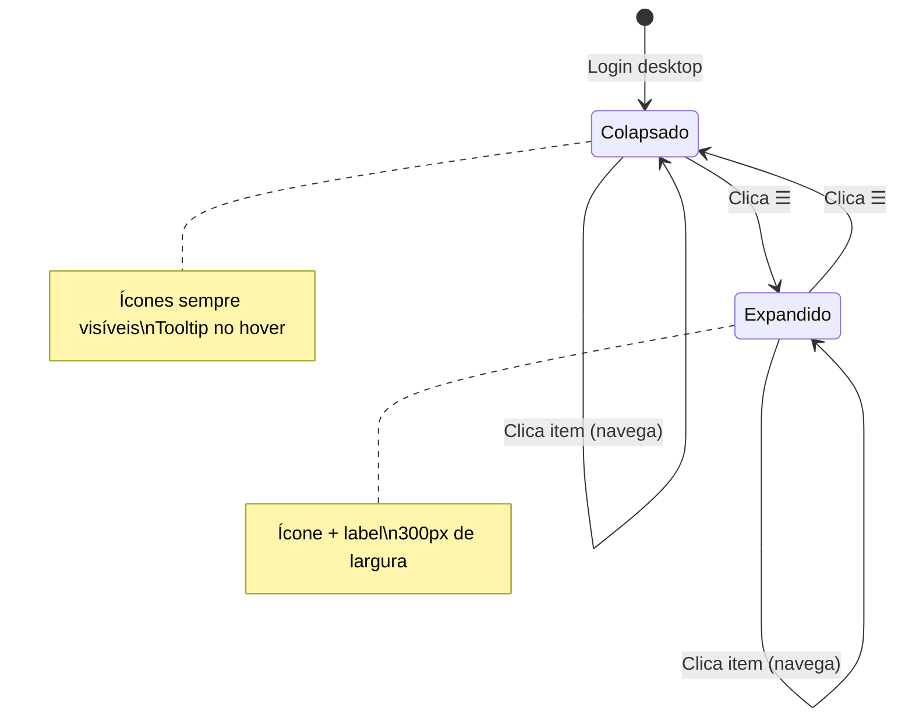
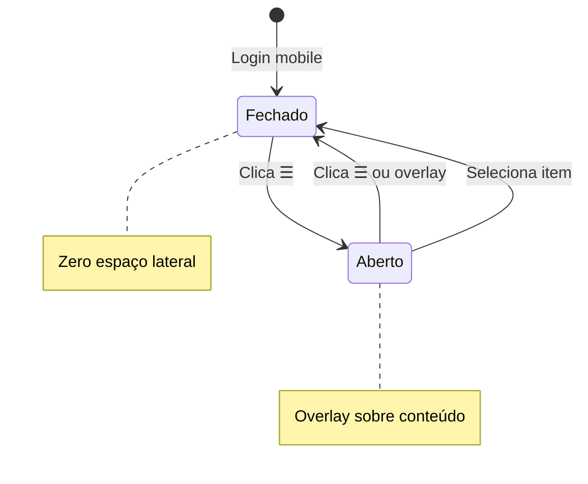

# Menu lateral colapsável na plataforma logada

## 1. Brainstorm

### Contexto e problema

Hoje, na **plataforma logada**, o menu lateral esquerdo é controlado por um botão de hambúrguer no topo da tela (barra superior). Ao clicar, o menu **some por completo** — o usuário perde a referência visual de navegação e precisa abrir o menu de novo para ver as opções.

Comportamento atual (técnico, para referência interna):
- Componente `SideNavMenu.vue` usa `q-drawer` com `drawerController` alternando entre aberto/fechado.
- Estado inicial: menu **fechado** (`drawerController: false`).
- Não existe modo intermediário — é tudo ou nada.

Isso afeta a experiência especialmente de **administradores**, que têm muitos itens no menu (Empresas, Usuários, Produtos, etc.) e usam a plataforma por longos períodos. Perder o menu inteiro reduz a área útil da tela, mas também **remove atalhos visuais** que poderiam permanecer como ícones.

**Fora de escopo desta demanda:** menu do site público (`layouts/Site.vue`, `novo-site/`) — o pedido refere-se à plataforma logada após login.

### Objetivo de negócio

Melhorar a **usabilidade do menu lateral** para que o usuário possa **ganhar espaço na tela sem perder orientação**: ao "fechar" o menu, ele deve **colapsar** e continuar exibindo os **ícones** dos itens principais, permitindo navegação rápida e reconhecimento visual do contexto.

### Perfis impactados

- [ ] Ex-colaborador (USER) — menu enxuto (2 itens)
- [x] Especialista (SPECIALIST) — 3 itens
- [x] RH empresa (COMPANY_ADMIN) — 1 item
- [x] Admin plataforma (ADMIN) — ~12 itens (maior benefício)
- [ ] Site público (visitante) — não afetado

### Alternativas consideradas

| Opção | Prós | Contras |
|---|---|---|
| **A — Modo mini nativo do Quasar** (`q-drawer` com prop `mini`) | Padrão do framework; ícones + tooltip nativo; menos código custom | Comportamento mobile precisa definição (mini vs overlay) |
| **B — Colapso via CSS/largura customizada** | Controle total do visual | Mais manutenção; duplicar lógica que o Quasar já oferece |
| **C — Manter hide/show + barra de ícones fixa separada** | Rail sempre visível independente do drawer | Dois componentes; mais complexo; inconsistente com layout atual |

**Decisão:** Opção A — modo mini nativo do Quasar (`q-drawer` + prop `mini`).

### Decisões do solicitante (2025-06-17)

| # | Pergunta | Decisão |
|---|---|---|
| 1 | Estado inicial ao entrar | **Colapsado** (só ícones) |
| 2 | Lembrar preferência entre sessões | **Não** |
| 3 | Mobile/tablet | **Manter overlay** que abre/fecha (some por completo) — não usar modo mini |
| 4 | Botão no desktop | **Só expandir ↔ colapsar** — menu nunca some |

Itens com link externo: tooltip com nome completo no modo colapsado (padrão Quasar mini).

---

## 2. Plan

### Resumo

Implementar menu lateral **colapsável em desktop** na plataforma logada usando o modo **mini** do `q-drawer` (Quasar). Ao entrar, o menu inicia **colapsado** (ícones visíveis). O botão do topo alterna entre expandido (ícone + texto) e colapsado — **sem esconder** o menu no desktop. Em **mobile/tablet**, preservar o comportamento atual: drawer em overlay que abre e fecha por completo.

### Escopo

**In:**
- `SideNavMenu.vue` — modo mini no desktop, drawer sempre visível acima do breakpoint
- Toggle do botão hambúrguer: desktop = expandir/colapsar; mobile = abrir/fechar overlay
- Estado inicial desktop: colapsado (mini)
- Tooltip nos ícones quando colapsado (labels dos itens)
- Estilos de hover/seleção adaptados ao modo mini
- Todos os perfis logados (ADMIN, USER, SPECIALIST, COMPANY_ADMIN)

**Out:**
- Site público e novo site
- Persistência de preferência (localStorage)
- Modo mini no mobile/tablet
- Redesign visual completo do menu (cores, tipografia) — só comportamento
- ~~Submenus ou agrupamento de itens~~ → **IN para perfil ADMIN** (agrupamento proposto na Fase Design)
- Alteração nos itens do menu por perfil (URLs permanecem; só hierarquia ADMIN)

### User stories

1. Como **administrador**, quero ver ícones do menu mesmo com o painel colapsado, para navegar rápido sem perder referência.
2. Como **usuário de desktop**, quero expandir o menu para ler os nomes completos dos itens quando precisar.
3. Como **usuário mobile**, quero que o menu continue abrindo em overlay e fechando por completo, para não ocupar espaço fixo na tela.
4. Como **qualquer perfil logado**, quero clicar no ícone de um item no modo colapsado e ir direto à página, sem precisar expandir antes.

### Critérios de aceite

- [ ] **Desktop:** ao carregar a plataforma, menu lateral visível em modo colapsado (~57px, só ícones)
- [ ] **Desktop:** botão hambúrguer alterna entre colapsado e expandido (300px, ícone + label)
- [ ] **Desktop:** menu **nunca** desaparece por completo — drawer permanece visível
- [ ] **Desktop:** hover no ícone colapsado exibe tooltip com nome do item
- [ ] **Desktop:** clique em item navega normalmente (rotas internas e links externos)
- [ ] **Mobile/tablet:** menu abre em overlay e fecha por completo (comportamento atual preservado)
- [ ] **Mobile/tablet:** botão hambúrguer abre/fecha overlay — sem modo mini
- [ ] Estilos de hover existentes funcionam nos dois modos (expandido e colapsado)
- [ ] **Admin:** 4 grupos — Cadastros, Simulador, Operações, Consultas
- [ ] **Consultas** inclui Ver Produtos do Usuário e Ver Objetivos dos Clientes
- [ ] `yarn lint` passa

### Dependências

- Nenhuma dependência de backend
- Nenhuma dependência de design externo
- Quasar 1 (`q-drawer` props: `mini`, `mini-width`, `width`, `show-if-above`)

### Complexidade

- [ ] P | [ ] M | [x] G

Justificativa: colapso + agrupamento ADMIN + lógica dual desktop/mobile + expansion no modo mini elevam escopo.

---

## 3. Design

### Onde na plataforma

- **Área:** Plataforma logada (após login) — layout `Platform.vue`
- **Componentes visíveis:** barra superior (Prepara.me + botão menu + perfil) + menu lateral esquerdo + conteúdo principal
- **Perfis:** ADMIN, USER, SPECIALIST, COMPANY_ADMIN — mesmo padrão visual para todos; itens variam por perfil

### Estados do menu

#### Desktop (telas acima do breakpoint Quasar / não mobile-tablet)

| Estado | Largura | O que o usuário vê | Como chega |
|---|---|---|---|
| **Colapsado** (padrão) | ~57px | Coluna fixa branca com ícones empilhados | Ao entrar na plataforma |
| **Expandido** | 300px | Ícone + nome de cada item (como hoje) | Clica no botão ☰ na barra superior |

Transição suave entre os dois estados (animação nativa do Quasar).

#### Mobile / tablet

| Estado | O que o usuário vê | Como chega |
|---|---|---|
| **Fechado** (padrão) | Menu **não ocupa** espaço — conteúdo em tela cheia | Ao entrar ou após fechar |
| **Aberto** | Painel lateral **por cima** do conteúdo (overlay), largura total do drawer | Clica no botão ☰ |

Toque fora do menu ou navegação pode fechar o overlay (comportamento Quasar padrão).

### Fluxo do usuário

#### Desktop — expandir / colapsar

1. Usuário faz login e cai no painel (`/platform` ou rota de destino).
2. Menu lateral aparece **colapsado** — ícones alinhados verticalmente à esquerda.
3. Usuário passa o mouse sobre um ícone → **tooltip** com o nome do item (ex.: "Empresas", "Ver Objetivos dos Clientes").
4. Usuário clica no ícone → navega direto para a página (sem precisar expandir).
5. Usuário clica no ☰ → menu **expande**; vê ícone + texto de todos os itens.
6. Usuário clica no ☰ de novo → menu **colapsa**; ícones permanecem visíveis (nunca some).

#### Mobile — abrir / fechar

1. Usuário faz login — **sem** barra lateral fixa.
2. Clica no ☰ → menu desliza como overlay.
3. Escolhe um item ou fecha → menu **some por completo**.

### Telas / áreas afetadas

| Área (nome amigável) | O que muda |
|---|---|
| Menu lateral da plataforma | Novo comportamento colapsável (desktop) |
| Botão de menu (☰) no topo | Desktop: expande/colapsa; Mobile: abre/fecha |
| Conteúdo principal | Ganha ~57px fixos de margem esquerda no desktop (rail de ícones); mobile inalterado |

**Não muda:** itens do menu por perfil, barra de perfil, cores da marca, páginas internas.

### Aparência visual (mantendo identidade atual)

- **Fundo do menu:** branco (`#fff`) — igual hoje
- **Tipografia:** Nunito, peso 700 nos itens
- **Cor do texto:** `#454545`
- **Hover:** gradiente roxo/rosa no texto e ícone; faixa lateral direita `#c1c3d6` — **preservar** nos modos expandido e colapsado
- **Ícones:** Material Design Icons já usados (mdi-domain, mdi-cart, etc.)
- **Modo colapsado:** ícones centralizados na faixa estreita; tooltip escuro padrão Quasar à direita do ícone
- **Item ativo:** sem destaque persistente hoje — **não introduzir** nesta demanda (escopo = comportamento)

### Textos e labels

Nenhum texto novo na interface. Labels existentes dos itens aparecem:
- **Expandido:** ao lado do ícone (como hoje)
- **Colapsado:** no tooltip ao passar o mouse

Botão ☰ permanece sem label (só ícone).

### Estados e edge cases

| Situação | Comportamento esperado |
|---|---|
| Login desktop | Menu colapsado visível imediatamente |
| Login mobile | Menu fechado; tela cheia para conteúdo |
| Admin com ~12 itens colapsado | **Agrupar itens** (ver seção abaixo) — rail com ~4 ícones de grupo em vez de lista longa |
| RH com 1 item | Ícone único visível no rail colapsado |
| Link externo (Google Sheets) | Tooltip com nome completo; clique abre nova aba |
| Redimensionar janela desktop → mobile | Ao cruzar breakpoint, drawer passa a overlay fechado (sem mini fixo) |
| Redimensionar mobile → desktop | Drawer fixo colapsado reaparece |
| Recarregar página (F5) | Desktop volta colapsado (sem memória de preferência) |
| Erro / menu vazio (perfil inválido) | Drawer não renderiza — comportamento atual mantido |

### Diagrama — desktop



### Diagrama — mobile



### Agrupamento do menu ADMIN (aprovado)

**Decisão (2025-06-17):** incluir agrupamento nesta demanda. Nomes aprovados pelo solicitante.

| Grupo | Ícone | Itens |
|---|---|---|
| **Cadastros** | `mdi-folder-multiple-outline` | Empresas, Usuários, Funcionários, Planos de Assinaturas, Especialistas, Produtos |
| **Simulador** | `mdi-monitor-dashboard` | Grupos de Vídeos do Simulador, Vídeos do Simulador |
| **Operações** | `mdi-cog-outline` | Adicionar Produto para Usuário, Mentorias Coletivas, Materiais Gratuitos |
| **Consultas** | `mdi-chart-box-outline` | Ver Produtos do Usuário, Ver Objetivos dos Clientes |

Perfis USER, SPECIALIST e COMPANY_ADMIN: menu **flat** (sem grupos).

#### Comportamento por modo

| Modo | Comportamento |
|---|---|
| **Expandido** | 4 grupos em accordion; clique expande/colapsa filhos |
| **Colapsado (mini)** | Rail com **4 ícones de grupo**; hover/click abre flyout lateral com filhos |
| **Mobile** | Overlay com accordion — mesma hierarquia |

#### Itens flat (colapsado)

- Item flat: tooltip + clique navega direto
- Grupo (mini): tooltip com nome do grupo; flyout lista filhos

---

## 4. Tech

### Agentes / skills na implementação

- Agente: **orquestrador** → domínio plataforma logada / auth-rotas
- Skills: `preparame-vue-quasar-base`, `preparame-router-auth`

### Arquivos a alterar/criar

| Arquivo | Ação | Descrição |
|---|---|---|
| `src/components/platform/navMenu/SideNavMenu.vue` | editar | Modo mini, toggle desktop/mobile, template com grupos |
| `src/components/platform/navMenu/menuConfig.js` | **criar** | Extrair config de menu (flat + grupos ADMIN) |
| `docs/02-quem-usa/administrador-da-plataforma.md` | editar | Documentar grupos do menu admin (opcional pós-dev) |

**Sem alteração** em `Platform.vue`, `Toolbar.vue`, `ToolbarMobile.vue` — toggle continua via evento `toogleMenu` existente.

### Modelo de dados do menu

Novo arquivo `menuConfig.js`:

```js
// Item leaf
{ icon, label, url }

// Grupo (somente ADMIN)
{ type: 'group', icon, label, items: [ /* leaf items */ ] }

// Por perfil
export const menuByUserType = {
  ADMIN: { groups: [ /* 4 grupos */ ] },
  USER: { items: [ /* flat */ ] },
  // ...
}
```

### Lógica de estado (`SideNavMenu.vue`)

| Variável | Desktop (inicial) | Mobile (inicial) |
|---|---|---|
| `drawerOpen` | `true` (sempre visível) | `false` (fechado) |
| `mini` | `true` (colapsado) | `false` (ignorado) |
| `isMobile` | `false` | `true` (`window.mobileAndTabletCheck()`) |

**`toogleMenu()`:**
```js
if (this.isMobile) {
  this.drawerOpen = !this.drawerOpen;
} else {
  this.mini = !this.mini;
}
```

### Props do `q-drawer`

```html
<q-drawer
  v-model="drawerOpen"
  :mini="!isMobile && mini"
  :mini-width="57"
  :width="300"
  show-if-above
  bordered
  :overlay="isMobile"
  content-class="side-nav-menu"
>
```

- Desktop: `drawerOpen=true` fixo; `mini` alterna colapsado/expandido
- Mobile: `mini=false`; `drawerOpen` alterna overlay

### Template do menu

- **ADMIN:** `v-for` em `groups` → `q-expansion-item` com filhos `q-item`
- **Demais perfis:** `v-for` em `items` → `q-item` flat (como hoje)
- Itens leaf: reutilizar método `goUrl(url)` existente
- Tooltip em item flat no mini: `q-tooltip` com `label` quando `mini && !isMobile`
- Grupos no mini: comportamento nativo Quasar — expansion header vira ícone; filhos em flyout (`mini-to-overlay` implícito no QExpansionItem dentro de drawer mini)

### Rotas

Nenhuma rota nova. URLs dos itens **inalteradas**.

### API (backend externo)

Nenhuma.

### CRUD genérico?

- [ ] Sim
- [x] Não — componente custom de navegação

### Riscos técnicos e mitigação

| Risco | Mitigação |
|---|---|
| Expansion + mini instável visualmente | Testar hover/click nos 4 grupos; ajustar CSS se flyout cortar |
| `drawerOpen=false` no desktop esconder menu | Garantir `drawerOpen=true` quando `!isMobile`; toggle só mexe em `mini` |
| Resize desktop↔mobile | Listener `resize` ou `$q.screen` para resetar estado ao cruzar breakpoint |
| Hover styles quebram no mini | Ajustar seletores SCSS para `.q-mini-drawer` |

### Plano de teste manual

- [ ] **ADMIN desktop:** login → menu colapsado com 4 ícones de grupo
- [ ] **ADMIN desktop:** ☰ expande → accordion com Cadastros/Simulador/Operações/Consultas
- [ ] **ADMIN desktop:** ☰ colapsa → volta aos 4 ícones
- [ ] **ADMIN desktop:** flyout de Cadastros → navega para Empresas
- [ ] **ADMIN desktop:** Consultas → Ver Objetivos abre nova aba
- [ ] **USER desktop:** 2 itens flat, colapsado/expandir OK
- [ ] **SPECIALIST / COMPANY_ADMIN:** menu flat funciona
- [ ] **Mobile (dev tools):** menu fechado ao entrar; ☰ abre overlay; seleção fecha
- [ ] **Mobile:** grupos ADMIN em accordion dentro do overlay
- [ ] `yarn lint`

---

## 5. Aprovação 1 — Pré-desenvolvimento

| | |
|---|---|
| Data | 2025-06-17 |
| Aprovado por | solicitante |
| Decisão | aprovado |
| Observações | Inclui agrupamento ADMIN (Cadastros, Simulador, Operações, Consultas) |

---

## 6. Desenvolvimento

### Progresso

- [x] Implementação (`SideNavMenu.vue` + `menuConfig.js`)
- [x] Modo mini desktop + overlay mobile
- [x] Agrupamento ADMIN (4 grupos)
- [x] Lint (`yarn lint`)
- [ ] Doc produto atualizada (opcional — admin menu groups)

### Notas de implementação

- **`menuConfig.js`:** config extraída; ADMIN com 4 grupos; demais perfis flat
- **`SideNavMenu.vue`:** `drawerOpen=true` no desktop amplo; `mini=true` no load; toggle alterna `mini` (desktop) ou `drawerOpen` (overlay)
- **Mini ADMIN:** grupos usam `q-menu` flyout (não `q-expansion-item`, que esconde filhos no mini)
- **Viewport:** `isOverlayMode` = UA mobile **ou** largura &lt; 1024px — alinhado ao breakpoint do drawer
- Fecha overlay automaticamente após navegação
- Estilos hover preservados; ajustes para `.q-mini-drawer`

## 7. Aprovação 2 — Pós-desenvolvimento

| | |
|---|---|
| Data | 2025-06-17 |
| Aprovado por | solicitante |
| Decisão | aprovado |
| Observações | — |

---

## 8. Code Review

### Checklist

- [x] Critérios de aceite OK
- [x] Escopo respeitado
- [x] Padrões Vue 2 + Quasar 1
- [x] CRUD genérico N/A
- [x] Rotas inalteradas
- [x] Sem secrets
- [x] Lint OK

### Findings (Bugbot)

| Severidade | Local | Descrição | Status |
|---|---|---|---|
| Alta | SideNavMenu mini + expansion | Filhos ADMIN inacessíveis no mini | **Corrigido** — `q-menu` flyout no mini |
| Alta | SideNavMenu breakpoint | Menu sumia em viewport estreita | **Corrigido** — `isOverlayMode` unificado |

### Resultado final

- [x] Apto a merge
- [ ] Ajustes necessários
