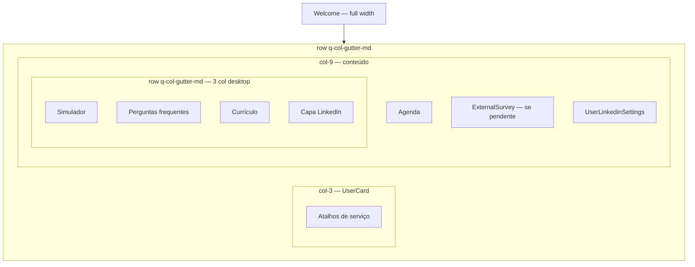

# Polish visual do painel do ex-colaborador (HomeUser)

## 1. Brainstorm

### Contexto e problema

A página inicial do ex-colaborador (`/platform` → `HomeUser.vue`) acumulou componentes ao longo do tempo. O resultado visual está desorganizado: espaçamentos inconsistentes, bordas com raios diferentes, cards aninhados, CTAs de pesquisa duplicados e grid desktop incorreto (`col-3` + `col-8`).

### Objetivo de negócio

Melhorar a primeira impressão e a usabilidade do painel, facilitando encontrar ações prioritárias sem alterar regras de negócio.

### Perfis impactados

- [x] Ex-colaborador (USER)

### Decisões do solicitante (2026-07-12)

| Pergunta | Decisão |
|---|---|
| Pesquisa duplicada | **Banner no `UserCard` + card `ExternalSurvey`**; remover popup |
| LinkedIn | **Manter posição atual**; só alinhar visual |
| Ferramentas | **3 colunas no desktop** (quando couber), **1 coluna no mobile** |
| Sidebar | **Manter `col-3`** à esquerda |
| Polish visual | **Forte** — tokens + reorganizar + unificar tipografia e botões |
| Ordem mobile | Welcome → Sidebar → Agenda → Pesquisa → LinkedIn → Ferramentas |
| Plano aposentadoria | **Manter simplificado** (sem pesquisa/LinkedIn) |
| Escopo geral | **Opção B+** — reorganizar + polish visual forte |

### Alternativas consideradas

Opção **B** escolhida: reorganização leve com sistema mínimo de espaçamento/bordas, sem mudar funcionalidades.

---

## 2. Plan

### Resumo

Reorganizar o layout do `HomeUser.vue` com grid correto, espaçamento e bordas uniformes, eliminar cards aninhados desnecessários, remover o popup redundante de pesquisa (mantendo banner no `UserCard` e card `ExternalSurvey`), e alinhar visualmente o bloco de LinkedIn ao padrão das demais seções — preservando comportamento de plano aposentadoria.

### Escopo

**In:**
- Corrigir grid desktop (`col-3` + `col-9`) e gutters uniformes
- Tokens visuais mínimos no painel USER (radius, gap, padding de seção)
- Substituir wrappers `external-user-card-container` por grid responsivo: **3 colunas desktop / 1 coluna mobile**
- Unificar tipografia (títulos de seção, corpo) e estilo de botões nos cards de ferramentas
- Consolidar pesquisa: manter banner “Avalie sua antiga empresa” no `UserCard` e card `ExternalSurvey`; remover popup em `HomeUser`
- Alinhar `UserLinkedinSettings` ao padrão visual (radius, margens)
- Ajustar margens internas de `Schedule` e cards de ferramentas para não “empilhar” padding
- Limpar aninhamento duplicado de `external-user-options` e código morto comentado
- Escopar estilos globais `h2` do `HomeUser.vue` (evitar vazamento)
- Mobile: stack consistente sem alterar fluxos

**Out:**
- Redesign completo / nova identidade visual
- Mudança de textos ou copy dos cards
- Alteração de APIs ou regras de negócio
- Refatorar lógica de produtos, agenda ou mentorias
- Painéis de outros perfis (ADMIN, RH, especialista)
- Edição da doc de produto (fluxo inalterado)

### User stories

1. Como ex-colaborador, quero ver um painel organizado e alinhado, para encontrar rapidamente agenda, pesquisa e ferramentas.
2. Como ex-colaborador com pesquisa pendente, quero atalho na sidebar e card informativo na coluna principal, sem popup intrusivo ao entrar.
3. Como ex-colaborador em plano aposentadoria, quero a versão simplificada do painel, sem pesquisa nem LinkedIn.
4. Como ex-colaborador no mobile, quero as seções empilhadas com espaçamento consistente.

### Critérios de aceite

- [ ] Desktop: sidebar `col-3` + conteúdo `col-9`, sem desalinhamento horizontal visível
- [ ] Espaçamento vertical entre seções uniforme (gap definido, sem `q-ma-md` duplicado card+pai)
- [ ] Todos os cards do painel USER com mesmo `border-radius` (12px)
- [ ] Ferramentas em grid **3 colunas desktop** (breakpoint ~1024px+) e **1 coluna mobile**
- [ ] Tipografia e botões dos cards de ferramentas visualmente consistentes
- [ ] Pesquisa pendente: banner no `UserCard` + card `ExternalSurvey` na coluna principal; **sem popup** ao entrar
- [ ] LinkedIn permanece na coluna principal, visualmente integrado ao padrão
- [ ] Plano aposentadoria: sem `ExternalSurvey`, sem `UserLinkedinSettings`, sem popup de pesquisa
- [ ] Mobile: colunas empilham sem sobreposição ou margens assimétricas graves
- [ ] `yarn lint` passa nos arquivos alterados

### Dependências

- Nenhuma alteração de backend
- Nenhum design externo — seguir tokens Quasar + variáveis SCSS existentes (`$prepara-me`, etc.)

### Complexidade

- [ ] P | [x] M | [ ] G

---

## 3. Design

### Onde na plataforma

Plataforma logada → perfil **USER** → Painel inicial (`/platform` → `HomeDynamicTemplate` → `HomeUser.vue`).

### Fluxo do usuário

1. Login → chega ao painel
2. Vê card de boas-vindas (topo, full width)
3. Abaixo: **sidebar esquerda** (atalhos de serviço) + **coluna principal**
4. Coluna principal, de cima para baixo:
   - Agenda (`Schedule`)
   - Pesquisa (`ExternalSurvey`) — só se pendente e não aposentadoria
   - LinkedIn (`UserLinkedinSettings`) — só se não aposentadoria
   - Grid de ferramentas (**3 col** desktop, **1 col** mobile)
5. Mobile: ordem **Welcome → Sidebar → Agenda → Pesquisa → LinkedIn → Ferramentas**

### Telas / áreas afetadas

| Área | Componente | Mudança |
|---|---|---|
| Layout | `HomeUser.vue` | Grid, gutters, remover popup, grid ferramentas |
| Sidebar | `user/UserCard.vue` | Manter banner “Avalie sua antiga empresa”; ajustar margens se necessário para alinhar ao grid |
| Pesquisa | `externalUser/ExternalSurvey.vue` | Ajuste fino de margens (se necessário) |
| LinkedIn | `UserLinkedinSettings.vue` | Radius/padding alinhados |
| Agenda | `templates/Schedule.vue` | Remover `q-ma-md` redundante |
| Ferramentas | Cards de simulador, perguntas, currículo, capa LinkedIn | Grid 3 col desktop / 1 col mobile; tipografia e botões unificados |

### Estados e edge cases

| Situação | Comportamento esperado |
|---|---|
| Pesquisa pendente | Card `ExternalSurvey` visível na coluna principal |
| Pesquisa respondida | Card e banner somem; sem popup |
| Plano aposentadoria | Welcome simplificado; sem pesquisa, LinkedIn, popup |
| Mobile | Welcome → Sidebar → Agenda → Pesquisa → LinkedIn → Ferramentas |
| Loading plano | Skeleton do welcome mantido |

### Diagrama

### Tokens visuais (painel USER)

| Token | Valor | Uso |
|---|---|---|
| `--home-card-radius` | `12px` | Todos os `q-card` do painel |
| `--home-section-gap` | `16px` | Gap vertical entre seções (`q-mb-md` ou gutter) |
| Padding de seção | `16px` (`q-pa-md`) | `q-card-section` padrão |
| Título de card | `text-h6 text-weight-bold` | Cabeçalhos de seção |
| Botão primário | `color="secondary"` `no-caps` | CTAs dos cards de ferramentas |
| Margem externa do painel | `q-px-md` / `q-px-sm` mobile | Container principal |

---

## 4. Tech

### Agentes / skills na implementação

- Agente: ex-colaborador
- Skills: `preparame-ex-colaborador`, `preparame-vue-quasar-base`

### Arquivos a alterar/criar

| Arquivo | Ação | Descrição |
|---|---|---|
| `src/components/platform/home/HomeUser.vue` | editar | Grid 3+9, remover popup pesquisa, grid ferramentas, tokens SCSS, limpar template |
| `src/components/platform/home/user/UserCard.vue` | editar | Ajustar margens/alinhamento ao grid (banner de pesquisa **mantido**) |
| `src/components/platform/home/UserLinkedinSettings.vue` | editar | Radius 12px, classes alinhadas |
| `src/components/platform/home/templates/Schedule.vue` | editar | Remover `q-ma-md` do card (pai controla espaço) |
| `src/components/platform/home/externalUser/ExternalUserInterviewSimulatorCard.vue` | editar | Ajustar padding para grid |
| `src/components/platform/home/externalUser/ExternalUserMostCommonQuestions.vue` | editar | Idem |
| `src/components/platform/home/externalUser/ExternalUserResumeCreatorCard.vue` | editar | Idem |
| `src/components/platform/home/externalUser/ExternalUserLinkedinCover.vue` | editar | Idem |

### Rotas

Nenhuma alteração.

### API (backend externo)

Nenhuma alteração.

### CRUD genérico?

- [ ] Sim
- [x] Não — componentes custom do painel USER

### Plano de teste manual

- [ ] Login USER patrocinado com pesquisa pendente → banner na sidebar + card na coluna principal, sem popup
- [ ] Login USER com pesquisa respondida → sem pesquisa em lugar nenhum
- [ ] Login USER plano aposentadoria → sem pesquisa, sem LinkedIn
- [ ] Desktop 1280px+ → grid alinhado, ferramentas em até 3 colunas
- [ ] Mobile → ordem Welcome → Sidebar → Agenda → restante
- [ ] Salvar LinkedIn → card permanece visualmente consistente
- [ ] `yarn lint`

---

## 5. Aprovação 1 — Pré-desenvolvimento

| | |
|---|---|
| Data | 2026-07-12 |
| Aprovado por | pendente |
| Decisão | pendente |
| Observações | Ajustes via formulário 2026-07-12: polish forte, grid 3 col ferramentas, ordem mobile definida |

---

## 6. Desenvolvimento

### Progresso

- [x] Implementação
- [x] Lint (`eslint` nos arquivos alterados)
- [ ] Doc produto atualizada (fluxo inalterado — não necessário)

### Notas de implementação

- `HomeUser.vue`: grid `col-md-3` + `col-md-9`, tokens CSS, popup removido, ferramentas em grid 3 col
- `UserCard.vue`: margens alinhadas, radius 12px
- `Schedule.vue`, `UserLinkedinSettings.vue`, welcome/survey: radius 12px
- Cards de ferramentas: layout unificado, títulos e botões `no-caps`

---

## 7. Aprovação 2 — Pós-desenvolvimento

*(pendente)*

---

## 8. Code Review

*(pendente)*
