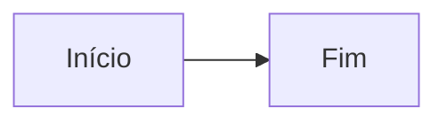

# Template — Nova Demanda

Copie este arquivo para `docs/desenvolvimento/demandas/YYYY-MM-DD-slug-da-demanda.md`

---

```yaml
---
titulo: ""
slug: ""
criado: YYYY-MM-DD
status: brainstorm  # brainstorm | plan | design | tech | aguardando-aprovacao-1 | desenvolvimento | aguardando-aprovacao-2 | code-review | concluido | cancelado
solicitante: ""
agente-dev: ""  # preenchido na fase Tech (ex.: site-publico, plataforma-crud)
---
```

# [Título da demanda]

## 1. Brainstorm

### Contexto e problema


### Objetivo de negócio


### Perfis impactados

- [ ] Ex-colaborador (USER)
- [ ] Especialista (SPECIALIST)
- [ ] RH empresa (COMPANY_ADMIN)
- [ ] Admin plataforma (ADMIN)
- [ ] Site público (visitante)

### Alternativas consideradas

| Opção | Prós | Contras |
|---|---|---|
| A | | |
| B | | |

### Perguntas em aberto

- 

---

## 2. Plan

### Resumo


### Escopo

**In:**
- 

**Out:**
- 

### User stories

1. Como [persona], quero [ação], para [benefício].

### Critérios de aceite

- [ ] 
- [ ] 

### Dependências

- 

### Complexidade

- [ ] P | [ ] M | [ ] G

---

## 3. Design

### Onde na plataforma


### Fluxo do usuário

1. 

### Telas / áreas afetadas


### Estados e edge cases

| Situação | Comportamento esperado |
|---|---|
| Sucesso | |
| Erro | |
| Vazio | |

### Diagrama (opcional)



---

## 4. Tech

### Agentes / skills na implementação

- Agente: 
- Skills: 

### Arquivos a alterar/criar

| Arquivo | Ação | Descrição |
|---|---|---|
| | criar / editar | |

### Rotas


### API (backend externo)

| Método | Endpoint | Uso |
|---|---|---|
| | | |

### CRUD genérico?

- [ ] Sim — usar CrudQuery/CrudRegister
- [ ] Não — componente custom

### Plano de teste manual

- [ ] 

---

## 5. Aprovação 1 — Pré-desenvolvimento

| | |
|---|---|
| Data | |
| Aprovado por | |
| Decisão | pendente / aprovado / ajustes / cancelado |
| Observações | |

---

## 6. Desenvolvimento

### Progresso

- [ ] Implementação
- [ ] Rotas/menus
- [ ] Lint (`yarn lint`)
- [ ] Doc produto atualizada (se aplicável)

### Notas de implementação


---

## 7. Aprovação 2 — Pós-desenvolvimento

| | |
|---|---|
| Data | |
| Aprovado por | |
| Decisão | pendente / aprovado / ajustes |
| Observações | |

---

## 8. Code Review

### Checklist

- [ ] Critérios de aceite OK
- [ ] Escopo respeitado
- [ ] Padrões do projeto
- [ ] Sem secrets
- [ ] Lint OK

### Findings

| Severidade | Local | Descrição |
|---|---|---|
| | | |

### Resultado final

- [ ] Apt o a merge
- [ ] Ajustes necessários

```
