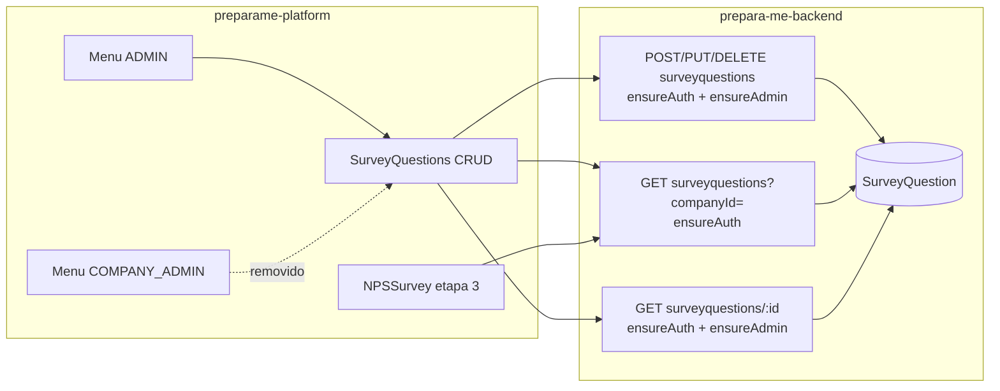

# System Design — Perguntas qualitativas só Admin

**Spec:** [2026-07-18-perguntas-qualitativas-so-admin.md](./2026-07-18-perguntas-qualitativas-so-admin.md) (aprovada)  
**Branch:** `feat/perguntas-qualitativas-so-admin`  
**Status:** verificado (entrega + testes)  
**Data:** 2026-07-19

---

## 1. Contexto e objetivos

- **Problema:** COMPANY_ADMIN gerencia perguntas qualitativas; ADMIN não tem acesso. Produto quer o inverso: só ADMIN cadastra/gerencia; RH sem acesso algum à gestão.
- **Metas:** RF-01…RF-07 / RN-01…RN-05; pesquisa do ex-colaborador (etapa qualitativa) continua funcionando (RN-04, CA-07).
- **NFR:** autorização real no backend (RNF-01); UX Admin com seleção de empresa (RNF-02); sem `@clamed/logger` / `light-node-metrics`.

## 2. Recomendacao e alternativas

### Recomendada — A: mover CRUD UI para ADMIN + proteger escrita na API; GET list permanece autenticado

| Prós | Contras |
|------|---------|
| Não quebra `NPSSurvey.vue` (usa `GET companies/surveyquestions?companyId=`) | COMPANY_ADMIN ainda *poderia* chamar GET via API (sem UI) |
| Mudança pequena, alinhada ao padrão atual de CRUD Admin | RF-05/06 da spec precisam do ajuste abaixo |
| Reutiliza `CrudQuery`/`CrudRegister` + `DialogSelect` de empresas | — |

**Ajuste necessário na interpretação da SPEC (RF-05/06 / Q-02):**  
“Gestão” = **POST / PUT / DELETE** (+ **GET by id** para tela de edição).  
**GET list** (`?companyId=`) continua disponível para usuários autenticados que respondem a pesquisa (USER / fluxo atual). Bloqueio total do GET quebraria CA-07.

### Alternativa descartada — B: endpoint separado de consumo + GET gestão só ADMIN

| Prós | Contras |
|------|---------|
| Separação limpa gestão vs consumo | Mais código (rota nova + alterar NPSSurvey) |
| GET gestão 100% ADMIN | Fora do menor MVP; sem ganho de negócio imediato |

**Por que descartar B no MVP:** valor está em tirar o cadastro do RH; split de endpoint é incremento opcional depois.

## 3. Visao de sistema

**Fronteiras:**
- Frontend: menu, rotas `userTypes`, filtros/campos empresa no CRUD.
- Backend: middlewares nas rotas de survey questions; sem mudança de schema.
- Sem workers/scripts/externos neste feat.

## 4. Componentes e responsabilidades

| Componente | Faz | Não faz |
|------------|-----|---------|
| `menuConfig.js` | Remove item do COMPANY_ADMIN; adiciona em ADMIN → Cadastros | Alterar outros menus |
| `companies.route.js` | `userTypes: ['ADMIN']` nas 3 rotas `/surveyQuestions*` | Novas rotas |
| `SurveyQuestionsQueryCrud.vue` | Filtro Empresa via `DialogSelect` (`table: companies`); remove `localStorage.companyId` oculto | Relatórios NPS |
| `SurveyQuestionsRegisterCrud.vue` | Campo Empresa obrigatório (`DialogSelect`); remove bind de `localStorage` | Mudar modelo de resposta da pesquisa |
| `companies.routes.ts` | Middlewares nas rotas surveyquestions | Novo use case / migration |
| Docs produto | Atualizar jornada RH / perfis | Site público |

## 5. Modelo de dados (alto nivel)

- **Sem alteração de schema.** Entidade `SurveyQuestion` (id, companyId, questionText, …) permanece.
- Consistência: mesmas operações TypeORM atuais; `companyId` obrigatório no create (já existente no body).

## 6. Fluxos principais

### UC-01 — Admin cadastra
1. ADMIN → menu Cadastros → Perguntas Qualitativas  
2. Filtra/seleciona empresa → Novo  
3. `POST /companies/surveyquestions` com `{ companyId, questionText }`  
4. Middlewares: `ensuredAuthenticated` + `ensureAdmin` → UseCase → DB  

### UC-02 — RH tenta acessar
1. Menu sem item  
2. URL `/surveyQuestions` → router bloqueia (`userTypes` só ADMIN)  
3. `POST/PUT/DELETE` com token RH → `AppError` “User is not admin” (403)  

### UC-03 — Colaborador responde (inalterado)
1. `NPSSurvey.searchCompanyQuestions` → `GET .../surveyquestions?companyId=`  
2. `ensureAuthenticated` (sem ensureAdmin) → lista → etapa 3  

## 7. API / contratos

| Método | Path | Auth MVP | Quem usa |
|--------|------|----------|----------|
| GET | `/companies/surveyquestions?companyId=` | `ensuredAuthenticated` | CRUD Admin + NPSSurvey |
| GET | `/companies/surveyquestions/:id` | `ensuredAuthenticated` + `ensureAdmin` | Tela edição Admin |
| POST | `/companies/surveyquestions` | `ensuredAuthenticated` + `ensureAdmin` | Cadastro Admin |
| PUT | `/companies/surveyquestions/:id` | `ensuredAuthenticated` + `ensureAdmin` | Edição Admin |
| DELETE | `/companies/surveyquestions/:id` | `ensuredAuthenticated` + `ensureAdmin` (já tem auth; acrescentar admin) | Exclusão Admin |

Payload create/update inalterado: `{ companyId, questionText }`.

**Nota:** GET list vazio hoje lança 404 no use case — fora de escopo corrigir, salvo se quebrar listagem Admin sem perguntas (avaliar no dev: retornar `[]` é melhoria pequena e recomendável se o CRUD quebrar).

## 8. Infra

- N/A — sem Compose/env novos. Dev local WSL existente.

## 9. Estrutura de pastas / branch

- Branch já aberta: `feat/perguntas-qualitativas-so-admin` (platform + backend).
- Arquivos tocados (previstos):

**platform**
- `src/components/platform/navMenu/menuConfig.js`
- `src/router/platform/companies.route.js`
- `src/components/platform/surveyQuestionsCrud/SurveyQuestionsQueryCrud.vue`
- `src/components/platform/surveyQuestionsCrud/SurveyQuestionsRegisterCrud.vue`
- `docs/02-quem-usa/*`, `docs/04-plataforma-logada/*`, `docs/07-jornadas/jornada-do-rh-empresa.md` (e correlatos)
- Skill/doc interna `preparame-nps-relatorios` (opcional, se atualizarmos skill do repo)

**backend**
- `src/shared/infra/http/routes/companies.routes.ts`

## 10. MVPs possíveis

- **MVP-1 (este):** UI só ADMIN + middlewares escrita/GET by id; GET list autenticado; docs produto.
- **Incremento 2:** endpoint de consumo dedicado + GET gestão só ADMIN; opcional filtrar GET list para impedir COMPANY_ADMIN.
- **Incremento 3:** retornar `[]` em vez de 404 quando empresa sem perguntas (hardening CRUD + NPS).

## 11. Riscos e decisoes abertas

| Risco | Mitigação |
|-------|-----------|
| Bloquear GET list quebra pesquisa | Design A: não bloquear GET list com ensureAdmin |
| Admin sem `companyId` no localStorage | DialogSelect obrigatório (padrão funcionários) |
| GET list ainda acessível ao RH via API | Aceito no MVP; UI removida; incremento 2 se necessário |
| Use case 404 em lista vazia | Testar no CRUD Admin; se falhar, retornar `[]` |

**Dúvidas:** nenhuma bloqueante (PowerBuilder N/A). Confirmar com aprovação deste design o ajuste RF-05/06 (GET list ≠ gestão).

## 12. Plano de implementacao

Ordem sugerida + skills:

1. **Backend** (`backend` + `preparame-nps-relatorios` contexto): middlewares nas rotas; checar GET vazio → `[]` se necessário para CRUD.  
2. **Frontend** (`frontend` + `preparame-crud-admin` / usar componentes): menu, rotas, Query/Register com DialogSelect empresa.  
3. **Docs produto** (`documentacao` parcial já no fluxo; fase 7 fecha README/ops).  
4. Depois: `review` → `teste-regra-negocio` (VAL-01…05) → `teste-automatizado` → `documentacao` → DoD.

Smoke manual mínimo pós-dev: login ADMIN CRUD; login RH sem menu/rota; USER pesquisa etapa 3.
