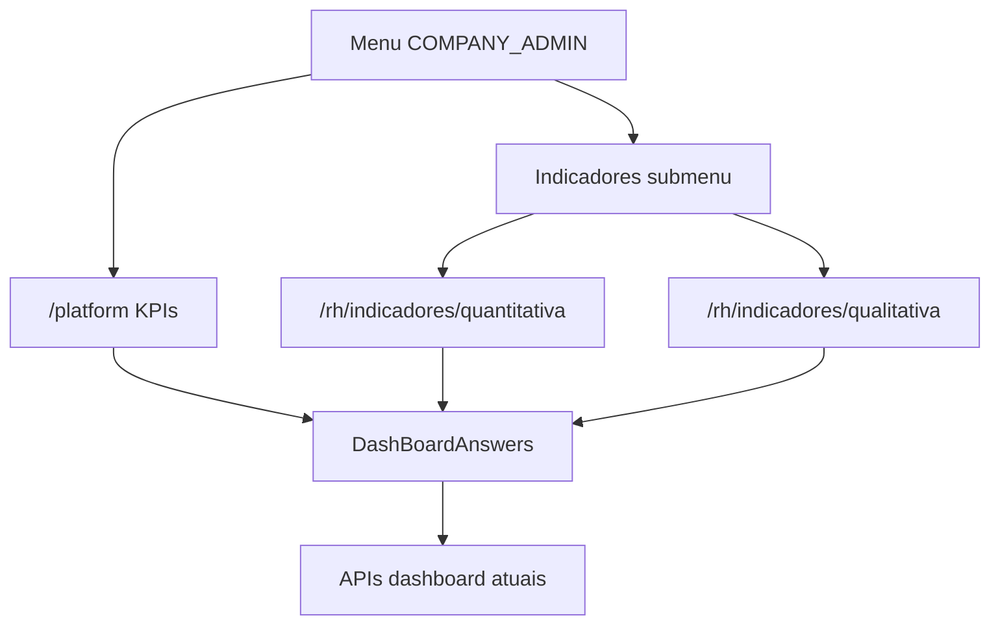

# System Design — Menu RH Indicadores (quantitativa / qualitativa)

**Spec:** [2026-07-19-rh-menu-indicadores-pesquisas.md](./2026-07-19-rh-menu-indicadores-pesquisas.md) (aprovada)  
**Branch:** `feat/rh-menu-indicadores-pesquisas`  
**Status:** aprovado  
**Data:** 2026-07-19

---

## 1. Contexto e objetivos

Separar a UX do COMPANY_ADMIN sem mudar APIs: Painel = KPIs; Indicadores = submenu com quantitativa e qualitativa, reaproveitando seções atuais de `DashBoardAnswers` / `DashBoardRhSurveys`.

## 2. Recomendacao e alternativas

### Recomendada — A: rotas RH + `section` no dashboard

| Prós | Contras |
|------|---------|
| Uma base de dados/filtros | Menu RH precisa de submenu |
| Pouca duplicação | `DashBoardAnswers` ganha flags |
| Alinha RN-02…04 | — |

Rotas sugeridas:
- `/platform` — painel KPIs (`section=metrics` default RH)
- `/rh/indicadores/quantitativa`
- `/rh/indicadores/qualitativa`

### Alternativa B — query `?view=`

Descartada: deep link e menu ativos ficam mais frágeis que path dedicado.

## 3. Visao de sistema

## 4. Componentes

| Peça | Faz |
|------|-----|
| `menuConfig.js` | Painel; Indicadores com `children` |
| `RhSideNavMenu` / `RhSideNavMenuPanel` | Expandir submenu; active state |
| `companies.route.js` (ou `rh.route.js`) | Novas rotas COMPANY_ADMIN |
| `HomeCompany.vue` / `DashBoardAnswers.vue` | Prop `rhSection`: `metrics` \| `quantitative` \| `qualitative` |
| `DashBoardRhSurveys.vue` | Props para mostrar só quant / só qual |

**Não faz:** novos use cases backend; CRUD de perguntas.

## 5. Modelo de dados

N/A — sem schema.

## 6. Fluxos

1. RH clica Painel → `rhSection=metrics` → só `DashBoardRhMetrics` (+ filtros/shell RH).  
2. Quantitativa → `showShutdown` + feeling map/compare; esconde `CompanyQuestionsCard`.  
3. Qualitativa → só `CompanyQuestionsCard` / bloco perguntas; esconde quantitativo.

## 7. API

N/A alteração. Mesmos GETs já usados pelo dashboard.

## 8. Infra

N/A.

## 9. Pastas / branch

- Branch já criada: `feat/rh-menu-indicadores-pesquisas`
- Principalmente frontend; docs produto RH

## 10. MVP

- **MVP-1:** menu + 3 visões + docs  
- Incremento: lazy load por seção / URLs amigáveis extras

## 11. Riscos

| Risco | Mitigação |
|-------|-----------|
| Menu RH sem submenu hoje | Estender panel com `q-expansion-item` ou children |
| `DashBoardAnswers` monolítico | Flags de seção, sem fork completo |
| Rail só ícones | Clique em Indicadores abre overlay/expande filhos |

## 12. Plano de implementacao

1. `frontend` + `preparame-crud`/nav: submenu + rotas  
2. Flags em `DashBoardAnswers` / `DashBoardRhSurveys` / `HomeCompany`  
3. Docs produto  
4. Review → VAL → (smoke manual; FE sem Jest) → docs → DoD  

Skills: `frontend`, `preparame-vue-quasar-base`, docs produto.
