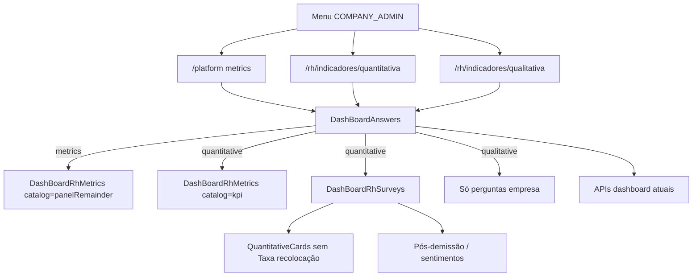

# System Design — Cards de KPI na Pesquisa quantitativa

**Spec:** [2026-07-21-rh-cards-pesquisa-quantitativa.md](./2026-07-21-rh-cards-pesquisa-quantitativa.md) (aprovada)  
**Branch:** `feat/rh-cards-pesquisa-quantitativa`  
**Status:** aprovado (alternativa A)  
**Data:** 2026-07-21  
**Skills na implementação:** `frontend` (+ docs produto); backend N/A

---

## 1. Contexto e objetivos

Corrigir a localização dos 8 cards de KPI do RH: hoje em `rhSection=metrics` (`DashBoardRhMetrics`); devem ir para `rhSection=quantitative` (Indicadores → Pesquisa quantitativa). O Painel mantém apenas os demais cards (placeholders “em breve”). Renomear **Marca → Risco de marca** e **Pessoas recolocadas → Pessoas realocadas**. Ocultar **Taxa de recolocação** na quantitativa (duplicata de **Realocados** — Q-01).

**NFR:** sem API nova; reutilizar fetch/filtros/timeline; sem regressão em qualitativa/menu.

## 2. Recomendacao e alternativas

### Recomendada — A: `DashBoardRhMetrics` com catálogo filtrável + montagem na quantitativa

| Prós | Contras |
|------|---------|
| Zero duplicação dos 8 cards / timeline / info | `DashBoardAnswers` passa a montar Metrics também em `quantitative` |
| Painel = só “demais” via filtro de catálogo | Prop nova (`cardCatalog` ou equivalente) |
| Alinha RN-01…05 e Q-01 | — |

**Mecânica:**
- Extrair ou parametrizar a lista de cards em `DashBoardRhMetrics`:
  - catálogo `kpi` = os 8 cards do §4.1 da spec
  - catálogo `panelRemainder` = `COMING_SOON_CARDS` (demais)
- `rhSection=metrics` → renderiza `DashBoardRhMetrics` com `panelRemainder` apenas
- `rhSection=quantitative` → renderiza `DashBoardRhMetrics` com `kpi` **acima** dos blocos de survey (`DashBoardRhSurveys`)
- Em `DashBoardRhQuantitativeCards`: **não** renderizar o card `relocationRate` (“Taxa de recolocação”); manter placeholders coming-soon da quantitativa se ainda fizerem sentido, ou deixar só surveys se o grid ficar vazio de KPIs reais — preferência MVP: ocultar só `relocationRate`, manter coming-soon atuais da quantitativa

### Alternativa B — copiar defs dos 8 cards para `DashBoardRhQuantitativeCards`

Descartada: duplica lógica de timeline/compare/`infoLabel`; maior risco de drift.

## 3. Visao de sistema

**Fronteiras:** só frontend Quasar/Vue (`preparame-platform`). Sem backend, workers ou infra nova.

## 4. Componentes e responsabilidades

| Peça | Faz | Não faz |
|------|-----|---------|
| `DashBoardAnswers.vue` | Em `showRhMetrics` (metrics): Metrics com catálogo painel; em `showRhQuantitative`: Metrics KPI + Surveys; labels de página inalterados | Novos endpoints |
| `DashBoardRhMetrics.vue` | Aceitar prop de catálogo (`kpi` \| `panelRemainder`); renomear títulos/infoLabels (Risco de marca, Pessoas realocadas) | Decidir rota |
| `DashBoardRhSurveys.vue` | Continuar montando QuantitativeCards + surveys; ordem: Metrics fica **fora** (pai) acima deste bloco | Definir lista dos 8 KPIs |
| `DashBoardRhQuantitativeCards.vue` | Remover/omitir card `relocationRate` | Reimplementar os 8 KPIs |
| `InformationDialogWidget.vue` (e mapeamento `openMetricInfo`) | Aceitar id/label **Risco de marca** (manter fallback “Marca” se necessário para legado Admin) | Mudar textos de negócio longos além do título |
| Rotas / `menuConfig.js` | Sem mudança de URLs/labels de menu | — |
| Docs produto RH | Atualizar onde dizem que esses KPIs ficam no Painel | — |

## 5. Modelo de dados (alto nivel)

N/A — sem schema/DB. Campos já existentes em `compareResults` / generals (`nps`, `laborRisk`, `brandRisk`, `realocateds`, `welcomed`, `realocatedCount`, `termination`, `laborIssues`).

## 6. Fluxos principais (da especificacao)

### UC-01 — KPIs na quantitativa

1. RH abre `/rh/indicadores/quantitativa` → `rhSection=quantitative`
2. `DashBoardAnswers` carrega dados (fluxo atual de filtros/compare)
3. Renderiza `DashBoardRhMetrics(catalog=kpi)` com os 8 cards
4. Renderiza `DashBoardRhSurveys` (sem Taxa de recolocação; com pós-demissão/sentimentos)
5. Info/timeline usam handlers já existentes (`openMetricInfo`, `toggleMetricExpand`)

### UC-02 — Painel só demais cards

1. RH abre `/platform` → `rhSection=metrics`
2. Renderiza `DashBoardRhMetrics(catalog=panelRemainder)` apenas
3. Não monta o catálogo `kpi`

### Qualitativa

Inalterada: sem Metrics KPI; só bloco qualitativo.

## 7. API / contratos

N/A — mesmos GETs do dashboard atual. Timeline dos KPIs continua usando o mesmo `loadMetricTimeline` / keys (`nps`, `laborRisk`, …).

## 8. Infra

N/A (WSL local: `npm run dev` já sobe Quasar). Compose/DB sem mudança.

## 9. Estrutura de pastas / branch

- Branch: `feat/rh-cards-pesquisa-quantitativa` (já criada a partir de `feat/rh-menu-indicadores-pesquisas`)
- Arquivos principais:
  - `src/components/platform/home/templates/DashBoardAnswers.vue`
  - `src/components/platform/home/templates/DashBoardRhMetrics.vue`
  - `src/components/platform/home/templates/DashBoardRhQuantitativeCards.vue`
  - `src/components/general/InformationDialogWidget.vue` (se necessário)
  - `docs/...` produto + este design + status da spec

## 10. MVPs possíveis

- **MVP-1 (este):** mover catálogo KPI → quantitativa; Painel = demais; renomes; ocultar Taxa de recolocação; docs RH pontuais.
- **Incremento:** unificar placeholders do Painel vs quantitativa; lazy load de timeline só na seção com KPIs.

## 11. Riscos e decisoes abertas

| Risco | Mitigação |
|-------|-----------|
| Props de Metrics hoje só passam no bloco `showRhMetrics` | Em quantitativa, montar segundo bloco Metrics (ou ampliar `v-if`) reutilizando as mesmas props de dados |
| Dialog info ainda keyed por `"Marca"` | Atualizar `infoLabel` + branch no dialog; fallback legado |
| QuantitativeCards fica só com coming-soon | Aceitável no MVP; grid de KPIs reais vem do Metrics |
| Duplicar fetch se Metrics+Surveys | Não: mesmo `compareResults` do pai |

**Duvidas:** nenhuma bloqueante (Q-01 resolvida: ocultar Taxa de recolocação). PowerBuilder N/A.

## 12. Plano de implementacao

1. **`frontend`:** prop/catálogo em `DashBoardRhMetrics` + renomes (Risco de marca, Pessoas realocadas)
2. **`frontend`:** `DashBoardAnswers` — Metrics `panelRemainder` no Painel; Metrics `kpi` na quantitativa (antes de Surveys); wire de events timeline/info
3. **`frontend`:** omitir `relocationRate`; placeholders da quantitativa fundidos no grid `kpi` de `DashBoardRhMetrics`; componente `DashBoardRhQuantitativeCards` removido
4. **`frontend`:** alinhar `InformationDialogWidget` / labels de info
5. **Docs:** painel RH / jornada / dashboard — localização dos KPIs
6. Pós-dev (orquestrador): `review` → `teste-regra-negocio` (VAL-01…04) → suite automatizada **N/A** (sem harness) → `documentacao`
