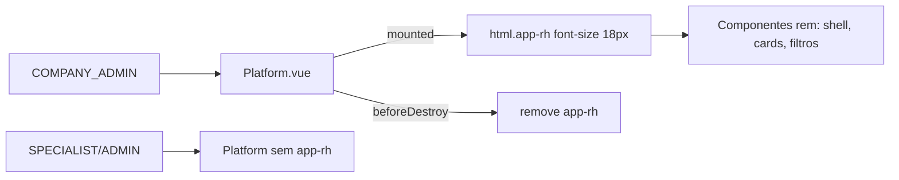

# Design — Tipografia +1 nos painéis RH

| Campo | Valor |
|-------|-------|
| SPEC | SPEC-2026-08-04-RH-TIPOGRAFIA |
| Branch | `feat/rh-tipografia-mais-um` |
| Data | 2026-08-04 |
| Status | aprovado / implementado |

## 1. Contexto e objetivos

- Textos dos painéis RH pequenos; meta: +1 nível tipográfico só para `COMPANY_ADMIN`.
- NFR: sem redesign; sem afetar site (`html.site-body`) nem outros perfis; mudança mínima e reversível.

## 2. Recomendacao e alternativas

### Recomendada — classe no `html` + base 18px (escopo RH)

Em `Platform.vue`: ao montar com `isCompanyAdmin`, adicionar `app-rh` em `document.documentElement`; remover em `beforeDestroy`. CSS:

```scss
html.app-rh {
  font-size: 18px; /* ~16px → +1 nível; rem do shell/cards escala junto */
}
```

**Por quê:** um ponto de controle; cobre menu, toolbar, KPIs e filtros que usam `rem`; já validado conceitualmente no WIP `e9e200d` (lá era `app-logged` em toda área logada).

### Alternativa descartada — editar dezenas de `font-size` nos SCSS RH

**Trade-off:** trabalhoso, inconsistente, difícil manter “+1 nível” uniforme.

## 3. Visao de sistema



Fronteira: só frontend `preparame-platform`.

## 4. Componentes e responsabilidades

| Peça | Responsabilidade |
|------|------------------|
| `Platform.vue` | Liga/desliga `app-rh` se `isCompanyAdmin` |
| Estilo global (em `Platform.vue` ou `_rh-shell.scss`) | `html.app-rh { font-size: 18px }` |
| Componentes RH | Sem mudança individual (consomem rem) |

**Não faz:** alterar `html.site-body`; bump para USER/SPECIALIST/ADMIN clássico.

## 5. Modelo de dados

N/A.

## 6. Fluxos

1. Login RH → Platform monta → `html.classList.add('app-rh')`.
2. Navegação entre rotas RH → classe permanece.
3. Logout / troca de layout → `beforeDestroy` remove classe.
4. Outro perfil → nunca adiciona.

## 7. API

N/A.

## 8. Infra

N/A.

## 9. Estrutura / branch

- Branch: `feat/rh-tipografia-mais-um`
- Spec: `docs/desenvolvimento/especificacoes/2026-08-04-rh-tipografia-mais-um.md`
- Este design: `...-rh-tipografia-mais-um-design.md`

## 10. MVPs

| MVP | Escopo |
|-----|--------|
| **MVP-1** | Classe `app-rh` + 18px; VAL-01…03 |
| MVP-2 (se necessário) | Ajustes pontuais em `px` fixos que sobrarem pequenos |

## 11. Riscos

| Risco | Mitigação |
|-------|-----------|
| Overflow em cards | Smoke visual VAL-01 |
| Quasar `px` internos pouco afetados | Aceito; MVP-2 se reclamar |
| Classe residual no html | `beforeDestroy` obrigatório |

## 12. Plano de implementacao

1. `Platform.vue`: `mounted` / `beforeDestroy` + constante `APP_RH_CLASS`.
2. CSS `html.app-rh { font-size: 18px }` (preferência: bloco no próprio `Platform.vue` como no WIP, ou `_rh-shell.scss`).
3. VAL-01…03 manuais; lint nos arquivos tocados.
4. CHANGELOG/README na fase docs.
