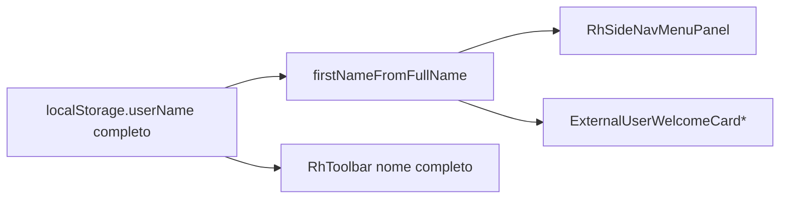

# Design — Boas-vindas com primeiro nome

| Campo | Valor |
|-------|-------|
| SPEC | SPEC-2026-08-05-BOAS-VINDAS-PRIMEIRO-NOME |
| Branch | `feat/boas-vindas-primeiro-nome` |
| Data | 2026-08-05 |
| Status | aprovado / implementado |

## 1. Contexto e objetivos

- Saudações “Olá” mostram nome completo; meta: só o primeiro token do nome.
- NFR: regra única, sem mudar storage; toolbar fora do escopo.

## 2. Recomendacao e alternativas

### Recomendada — util `firstNameFromFullName` + computed/props nas 3 UIs

```js
// src/utils/firstName.js
export function firstNameFromFullName(fullName, fallback = "Usuário") {
  const full = String(fullName || "").trim();
  if (!full) return fallback;
  return full.split(/\s+/)[0];
}
```

Consumo:
- `RhSideNavMenuPanel.vue`: computed `firstName` a partir da prop `userName`; template `{{ firstName }}`.
- `ExternalUserWelcomeCard.vue` / `Mobile`: ao ler `localStorage.userName`, guardar full se precisar e exibir `firstName` no template (ou computed).

**Por quê:** uma regra, testável, alinhada ao WIP `e9e200d` no painel RH e estendida aos cards USER.

### Alternativa descartada — gravar só o primeiro nome no login

**Trade-off:** quebra toolbar/identidade e qualquer uso do nome completo.

## 3. Visao de sistema



## 4. Componentes

| Peça | Faz |
|------|-----|
| `src/utils/firstName.js` | Extrai 1º nome + fallback |
| `RhSideNavMenuPanel.vue` | Saudação com firstName |
| `ExternalUserWelcomeCard.vue` | Idem |
| `ExternalUserWelcomeCardMobile.vue` | Idem |
| `RhToolbar.vue` | Sem mudança |

## 5. Modelo de dados

N/A — só string em memória/UI.

## 6. Fluxos

1. Login grava `userName` completo (inalterado).
2. Layout RH passa `userName` ao panel → computed firstName → “Olá, X!”.
3. HomeUser cards leem storage → firstName no texto.

## 7–8. API / Infra

N/A.

## 9. Branch / pastas

- `feat/boas-vindas-primeiro-nome`
- Spec + este design em `docs/desenvolvimento/especificacoes/`

## 10. MVPs

| MVP | Escopo |
|-----|--------|
| **MVP-1** | Util + 3 componentes de saudação; VAL-01…03 |
| MVP-2 | Partículas / nomes compostos (se pedido) |

## 11. Riscos

| Risco | Mitigação |
|-------|-----------|
| “Ana Clara” vira “Ana” | Aceito no MVP (RN explícita) |

## 12. Plano de implementacao

1. Criar `src/utils/firstName.js`.
2. Ajustar `RhSideNavMenuPanel.vue`.
3. Ajustar os dois `ExternalUserWelcomeCard*`.
4. VAL manuais + lint; docs na fase 7.
