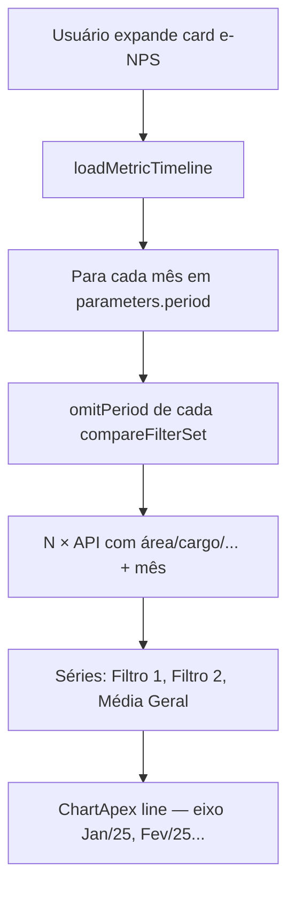

# Dashboard RH — comparativo em pesquisas e correção da timeline

## Contexto

Feedback após entrega dos cards principais:

| Área | Situação |
|---|---|
| Cards de métricas | OK — comparativo Filtro 1/2 + Média Geral |
| Avaliação pós demissão | Só **Sua empresa vs Média geral** — sem Filtro 1/2 |
| Mapa de sentimentos | Radar + barras só empresa vs mercado — sem comparativo de filtros |
| Evolução no tempo | Visual aprovado; **filtros não refletem** no gráfico |

---

## Estado atual (código)

### Pesquisas (`DashBoardRhSurveys`)

- `assignPrimaryReport()` grava `shutDown`, `feelingMap` **só do primeiro report** (`reports[0]`).
- `compareResults` traz NPS/riscos, mas **não** traz `shutDown` nem `feelingMap`.
- `shutdownSurveyColumns` / `feelingSurveyColumns` usam `buildSurveyItems(empresa, geral)` → colunas fixas **Sua empresa | Média geral**.

### Timeline (`loadMetricTimeline`)

- Para cada mês em `parameters.period`, dispara N requests (um por conjunto de filtro).
- Sobrescreve `period` do conjunto pelo mês do loop (correto para evolução).
- Séries usam label `Filtro 1` mesmo sem modo comparativo.
- **Não remove** `period` dos filtros ativos do conjunto antes do loop — hoje sobrescreve, mas UX confunde (usuário filtra mês e espera comportamento diferente).
- Dados de seed podem ter **poucos meses** → gráfico com 1 ponto parece “quebrado”.
- `extractCompareResult` não inclui dados de pesquisa.

---

## Parte 1 — Avaliação pós demissão (layout proposto)

### Recomendação: **Opção A — por pergunta, linhas comparativas**

Mesmo padrão mental dos cards e-NPS: cada pergunta vira um bloco com barras empilhadas.

```
┌─ Avaliação pós demissão ──────────────────────────────┐
│ Como você avalia a comunicação do processo?           │
│   Filtro 1 · Operações    ████████░░  8.2             │
│   Filtro 2 · Tecnologia   ██████░░░░  6.5             │
│   Média Geral             ███████░░░  7.1             │
│                                                       │
│ O processo foi conduzido com respeito?                │
│   Filtro 1 · Operações    ...                         │
│   ...                                                 │
└───────────────────────────────────────────────────────┘
```

**Por quê**

- Consistente com `UiMetricCard` / `UiProgressRow` já usados no RH.
- Comparação lado a lado por pergunta (melhor que tabs).
- Escala 1–10 já existe no `RhSurveyPanel`.

**Componentes**

| Peça | Ação |
|---|---|
| `UiSurveyComparePanel` (novo) | Lista de perguntas; cada uma com N linhas `UiProgressRow` |
| `RhSurveyComparePanel` | Wrapper RH fino |
| `DashBoardRhSurveys` | Substituir `RhSurveyPanel` fixo por painel comparativo quando `isCompareMode` |
| `extractCompareResult` | Incluir `shutDown: report.shutDown` |
| `compareSurveyResults[]` | Array paralelo a `compareResults` ou estender este |

**Modos de exibição** (reutilizar `isCompareMode` de `rhMetricDisplay.js`):

| Modo | Colunas / linhas |
|---|---|
| Baseline (1 conjunto, sem filtro) | **Sua Empresa** + **Média Geral** (como hoje) |
| 1 conjunto filtrado | **Filtro 1** + **Média Geral** |
| 2–3 conjuntos | **Filtro 1**, **Filtro 2**, … + **Média Geral** |

**Subtítulo opcional por linha:** chips do filtro ativo (`Área: Operações`) — igual PR-C dos cards.

### Alternativas descartadas (referência)

| Opção | Prós | Contras |
|---|---|---|
| **B — Tabs por filtro** | Simples de implementar | Ruim para comparar dois filtros de relance |
| **C — Tabela pergunta × filtro** | Compacto | Pouco legível no mobile; foge do design system |

---

## Parte 2 — Mapa de sentimentos (layout proposto)

Dois blocos distintos: **visual (radar)** e **numérico (barras)**.

### 2A — Radar / polar (visual)

**Recomendação: small multiples (3 mini radares)**

```
┌─ Mapa de sentimentos ─────────────────────────────────┐
│  ┌─────────┐   ┌─────────┐   ┌─────────┐              │
│  │ Filtro 1│   │ Filtro 2│   │ Média   │              │
│  │ (polar) │   │ (polar) │   │ mercado │              │
│  └─────────┘   └─────────┘   └─────────┘              │
└───────────────────────────────────────────────────────┘
```

**Por quê**

- Sobpor séries no polarArea fica ilegível com 3+ conjuntos.
- Mesma paleta/gradiente em todos; título abaixo de cada chart.
- Mobile: carrossel ou stack vertical (`grid 1 col`).

**Implementação**

- `UiFeelingMapCompare.vue`: recebe `seriesByFilter[]` com `{ label, feelings: [{ feeling, count }] }`.
- Reutiliza `ChartApex type="polarArea"` + `setChartOptions` extraído para helper.
- Baseline (sem comparativo): **1 radar** “Sua empresa” (como hoje).

### 2B — Barras comparativas (numérico)

**Recomendação: colunas dinâmicas no `UiSurveyPanel`**

Estender colunas de `feelingSurveyColumns`:

| Baseline | Comparativo (2 filtros) |
|---|---|
| Sua empresa \| Média geral | Filtro 1 \| Filtro 2 \| Média geral |

Cada coluna = mesma lista de sentimentos alinhada (`buildSurveyItems` generalizado para N fontes).

**Alternativa para muitos filtros:** gráfico de barras agrupadas (Apex `bar` stacked=false) — sentimento no eixo X, uma cor por filtro. Usar se polar ficar pesado; **não substituir** o radar, complementar.

### Dados

```js
extractCompareResult(report, label) {
  return {
    // ... métricas existentes
    shutDown: report.shutDown,
    feelingMap: report.feelingMap,
  };
}
```

Helper `buildMultiSurveyColumns(sources, labelKey)`:

```js
// sources = [{ key: 'filtro-1', title: 'Filtro 1', items: [...] }, ...]
```

---

## Parte 3 — Evolução no tempo (correção dos filtros)

### Problemas identificados

| # | Problema | Impacto |
|---|---|---|
| T1 | Timeline ignora `isCompareMode` nos labels | Sempre “Filtro 1” em vez de “Sua Empresa” |
| T2 | Filtro de **Período** no conjunto compete com eixo temporal | UX confusa; pode zerar pontos |
| T3 | `compareResults` / surveys não alimentam timeline de pesquisas | Escopo futuro |
| T4 | Poucos meses no seed | Gráfico com 1 ponto |
| T5 | Eixo X com texto longo (`janeiro de 2025`) | Poluição visual |

### Regras de produto (proposta)

1. **Timeline = evolução por mês** — usa todos os meses em `parameters.period`.
2. **Filtros de dimensão** (área, cargo, unidade, etc.) **aplicam** em cada ponto.
3. **Filtro Período no painel** = recorte do snapshot dos cards, **não** do eixo temporal.
   - Ao abrir timeline: **remover `period` do conjunto** antes de cada request (`omitPeriod(set)`).
4. Labels das séries seguem `isCompareMode` (Sua Empresa vs Filtro N).

### Correções técnicas (PR-T)

| # | Tarefa | Arquivo |
|---|---|---|
| T-fix-1 | `omitPeriod(filterSet)` em `loadMetricTimeline` | `DashBoardAnswers.vue` |
| T-fix-2 | Labels via `isCompareMode` + `compareFilterSets` | `loadMetricTimeline` |
| T-fix-3 | `formatPeriodAxisLabel("janeiro de 2025")` → `"Jan/25"` | `utils/rhMetricDisplay.js` |
| T-fix-4 | Recarregar timeline quando `@change` nos filtros (já parcial; validar) | `DashBoardAnswers.vue` |
| T-fix-5 | Mensagem se `< 2` períodos: “Dados insuficientes para evolução — cadastre demissões em meses distintos” | `UiMetricTimeline.vue` |
| T-fix-6 | Seed: espalhar `entryDate` em 3+ meses (backend) | `seed-test-users` |

### Fluxo corrigido



---

## Ordem de implementação sugerida

```
PR-T  Timeline filtros (rápido, desbloqueia feedback)     ~1 PR
PR-S1 Pós-demissão comparativo (Opção A)                  ~1 PR
PR-S2 Mapa sentimentos — barras N colunas                  ~1 PR
PR-S3 Mapa sentimentos — small multiples radar            ~1 PR
PR-C  Subtítulos/chips nos filtros (cards + pesquisas)    opcional
```

**Não misturar** tudo num PR — pesquisas e timeline têm escopos distintos.

---

## Critérios de aceite

### Timeline

- [ ] Filtro Área = Operações → linha reflete só Operações em cada mês
- [ ] Filtro Período no painel **não** reduz eixo X a 1 mês
- [ ] Baseline sem filtro → série “Sua Empresa” + “Média Geral”
- [ ] 2 conjuntos → duas séries + Média Geral
- [ ] Eixo X legível (abreviação mês/ano)

### Pós-demissão

- [ ] Cada pergunta mostra linhas por filtro + Média Geral
- [ ] Baseline = Sua Empresa + Média Geral (paridade com legado)

### Mapa de sentimentos

- [ ] Baseline: 1 radar + barras empresa vs mercado
- [ ] Comparativo: mini radares ou barras com coluna por filtro
- [ ] Mesmos sentimentos alinhados entre colunas

---

## Wireframe resumido (mobile)

```
[Filtros comparativos]

[Cards métricas — já OK]

── Avaliação pós demissão ──
Pergunta 1
  Filtro 1  ████ 8
  Filtro 2  ███  6
  Mercado   ████ 7

── Mapa de sentimentos ──
[Radar Filtro 1]
[Radar Filtro 2]
[Barras por sentimento — 3 colunas]
```

---

## Relacionado

- [Cards comparativos](./2026-06-19-dashboard-rh-cards-comparativo.md)
- [Filtros Quasar](./2026-06-19-dashboard-rh-filtros-quasar.md)
