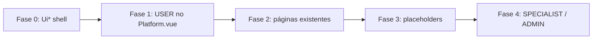

# Layout unificado para ex-colaborador (USER)

Plano para alinhar o perfil **USER** ao mesmo shell de menu, toolbar e tema já usado pelo RH (`COMPANY_ADMIN`), com componentização `Ui*` genérica + wrappers de domínio.

> **Status:** guardado para implementação futura. Ver [decisões pendentes](#decisões-pendentes) antes de desenvolver.

---

## Contexto atual

Hoje o shell da plataforma está **dividido por perfil** em `Platform.vue`:

| Perfil | Menu | Toolbar | Tema / padding |
|---|---|---|---|
| `COMPANY_ADMIN` | `RhSideNavMenu` (rail 57px + overlay) | `RhToolbar` | `platform--rh`, `rh-page-*` |
| `USER`, `SPECIALIST`, `ADMIN` | `SideNavMenu` (mini drawer antigo) | `Toolbar` / `ToolbarMobile` | fundo `#f5f6fa`, visual legado |

O perfil **USER** tem menu enxuto (2 itens) e páginas internas (`Orders`, simulador, etc.) ainda no visual antigo (breadcrumbs, cards Quasar padrão), enquanto o RH já tem shell, tema verde/cinza e padrão de “em breve”.

**Objetivo:** USER passa a usar o **mesmo shell de navegação** do RH; rotas que ainda não existem ganham **placeholder no mesmo layout**; componentização segue o padrão `Ui*` genérico + wrappers finos de domínio.

### Referências no código

- Shell: `src/layouts/Platform.vue`
- Menu RH: `src/components/platform/navMenu/RhSideNavMenu.vue`, `RhSideNavMenuPanel.vue`
- Menu legado: `src/components/platform/navMenu/SideNavMenu.vue`
- Config menu: `src/components/platform/navMenu/menuConfig.js`
- Tema: `src/css/rh-theme.scss`, `src/css/layout/_rh-shell.scss`
- Toolbar RH: `src/components/platform/toolbar/RhToolbar.vue`
- Header de página: `src/components/platform/layout/RhPageHeader.vue`

---

## Princípios (alinhados ao refactor P0/P1)

1. **Genérico em** `src/components/general/ui/` (ou `general/layout/` se preferir separar shell de cards).
2. **Wrappers de domínio** finos (`Rh*`, `User*`) só onde branding/texto diverge.
3. **Config declarativa** em `menuConfig.js` (itens, `url`, `comingSoon`).
4. **CSS compartilhado** via tema existente (`rh-theme.scss`, `_rh-shell.scss`) — renomear depois para `platform-shell` se quiser, mas não é blocker.
5. **Escopo incremental:** USER primeiro; ADMIN/SPECIALIST em fase seguinte (ADMIN tem `groups`, hoje não suportado pelo `RhSideNavMenu`).

---

## Fase 0 — Extrair primitivos do shell RH

Extrair lógica duplicável dos componentes RH para genéricos reutilizáveis:

| Novo componente | Origem | Responsabilidade |
|---|---|---|
| `UiSideNavShell.vue` | `RhSideNavMenu.vue` | Rail fixo, overlay desktop, drawer mobile, toggle, navegação, `comingSoon` |
| `UiSideNavPanel.vue` | `RhSideNavMenuPanel.vue` | Lista de itens, estado ativo, badge “em breve”; **slot `header`** para branding |
| `UiPlatformToolbar.vue` | `RhToolbar.vue` | Hambúrguer, título, dropdown perfil/logout |
| `UiPageHeader.vue` | `RhPageHeader.vue` | Título + subtítulo + slot de ações |
| `UiComingSoonPage.vue` | novo | Página placeholder: `UiPageHeader` + card explicativo |

**Refatoração dos existentes (sem mudar comportamento RH):**

```
RhSideNavMenu      → compõe UiSideNavShell + header RH (logo painel-demissão)
RhSideNavMenuPanel → vira UiSideNavPanel ou wrapper mínimo
RhToolbar          → compõe UiPlatformToolbar (title fixo RH)
RhPageHeader       → reexporta UiPageHeader (compatibilidade)
```

**CSS:** mover classes de `_rh-shell.scss` para nomes neutros (`platform-side-nav-*`) mantendo aliases `.rh-*` temporários para não quebrar dashboard RH.

---

## Fase 1 — Ativar shell novo para USER

### 1.1 `Platform.vue`

Substituir bifurcação `isCompanyAdmin` por algo como:

```js
usesProgramShell() {
  return ["COMPANY_ADMIN", "USER"].includes(localStorage.getItem("userType"));
}
```

- Menu: `UserSideNavMenu` ou um `PlatformSideNavMenu` config-driven.
- Toolbar: `UserToolbar` (título do programa ex-colaborador).
- Classes: `platform--rh` → renomear para `platform--program-shell` (aplicada a RH + USER).

### 1.2 Menu USER (`menuConfig.js`)

Expandir para espelhar a jornada documentada, no mesmo padrão RH (rota real ou `comingSoon`):

| Item | Rota | Status |
|---|---|---|
| Painel / Início | `platform` | existe |
| Minha agenda | `platform` (âncora) ou rota futura | decidir: fase 1 mantém no painel |
| Pesquisa pós-demissão | `survey` | existe |
| Simulador de entrevistas | `interviewSimulatorPresentation` | existe |
| Currículo e LinkedIn | `resumeCreatorPresentation` | existe |
| Meus pedidos | `orders` | existe |
| Mentorias coletivas | — | `comingSoon: true` |
| Materiais e dicas | — | `comingSoon: true` (opcional) |

Regras de negócio no menu (condicionais):

- Ocultar pesquisa se `isRetirementPlan` ou `surveyAnswered` (lógica no `loadMenu`, não no template).

### 1.3 Branding USER no painel lateral

`UserSideNavMenu` usa `UiSideNavShell` com header diferente do RH:

- Imagem: asset de acolhimento ex-colaborador (ou logo Prepara.me até ter arte).
- Saudação: `Olá, {{ userName }}!`
- Eyebrow opcional: “Programa de Recolocação” (paralelo ao RH).

---

## Fase 2 — Páginas existentes no layout RH

Adaptar telas USER **sem reescrever regra de negócio**, só shell visual:

| Página | Ajuste |
|---|---|
| `HomeUser.vue` | Padding via `rh-page-content`; opcional `UiPageHeader` no topo; cards migrando para `.rh-card` aos poucos |
| `Orders.vue` | Remover/substituir breadcrumbs por `UiPageHeader`; container `.rh-card` |
| `InterviewSimulatorPresentation.vue` | Idem |
| `InterviewSimulator.vue` | Idem |
| `NPSSurvey.vue` | Idem |
| `ResumeCreator*.vue` | Idem |

**Padrão de página:**

```vue
<q-page class="program-page">
  <UiPageHeader title="..." subtitle="..." />
  <div class="rh-card">…conteúdo existente…</div>
</q-page>
```

Wrapper opcional `UserPageShell.vue` (só slot + header) para não repetir markup.

---

## Fase 3 — Placeholders “em breve”

Para itens `comingSoon` no menu:

- **Curto prazo:** manter notify “Em breve” (já funciona no RH).
- **Médio prazo (recomendado):** rota genérica `/coming-soon/:slug?` renderizando `UiComingSoonPage` com título do item — mesmo layout, sensação de produto coeso.

Não criar telas fake com lógica; só shell + mensagem.

---

## Fase 4 — SPECIALIST e ADMIN (fora do MVP USER)

| Perfil | Bloqueio | Abordagem |
|---|---|---|
| `SPECIALIST` | menu flat, 3 itens | Reutilizar `UiSideNavShell` direto (rápido) |
| `ADMIN` | menu com `groups` | Estender `UiSideNavPanel` com grupos (expansion no overlay + submenu no rail, portando lógica de `SideNavMenu.vue`) |

Só depois de USER validado visualmente.

---

## Estrutura de arquivos proposta

```
src/components/general/ui/
  UiSideNavShell.vue
  UiSideNavPanel.vue
  UiPlatformToolbar.vue
  UiPageHeader.vue
  UiComingSoonPage.vue

src/components/platform/navMenu/
  UserSideNavMenu.vue          # wrapper USER
  RhSideNavMenu.vue            # wrapper RH (refatorado)
  menuConfig.js                # + itens USER

src/components/platform/toolbar/
  UserToolbar.vue              # wrapper USER
  RhToolbar.vue                # wrapper RH (refatorado)

src/components/platform/layout/
  UserPageShell.vue            # opcional

src/css/layout/
  _platform-shell.scss         # evolução de _rh-shell.scss
```

---

## Ordem de implementação sugerida



**Entregáveis por PR (recomendado):**

1. **PR1 — Shell genérico + RH inalterado visualmente** (refactor puro).
2. **PR2 — USER com menu/toolbar novos + `menuConfig` expandido**.
3. **PR3 — Migração visual das 5–6 rotas USER**.
4. **PR4 — Placeholder page + SPECIALIST** (se priorizado).

---

## Critérios de aceite

- [ ] USER desktop: rail 57px + overlay igual RH; mobile overlay completo.
- [ ] Toggle hambúrguer funciona em toolbar USER.
- [ ] Itens com rota navegam; `comingSoon` notifica ou abre placeholder.
- [ ] Pesquisa oculta para aposentadoria / já respondida.
- [ ] `COMPANY_ADMIN` continua idêntico (regressão zero).
- [ ] `yarn lint` passa.
- [ ] Doc mínima em `arquitetura-frontend.md` (seção shell + USER).

---

## Decisões pendentes

Confirmar antes de codar:

1. **Escopo de perfil:** só `USER` no MVP, ou incluir `SPECIALIST` já na primeira entrega?
2. **Menu USER:** aprova a lista expandida acima ou prefere manter só os 2 itens atuais com shell novo?
3. **Título da toolbar USER:** “Prepara.me”, “Programa de Recolocação” ou outro?
4. **Header lateral USER:** tem asset/imagem específica ou usamos logo Prepara.me por enquanto?
5. **HomeUser:** migra visual completa na fase 2 ou só shell externo (menu/toolbar/padding) na fase 1?

---

## Relacionado

- [Painel do ex-colaborador](../../04-plataforma-logada/painel-do-ex-colaborador.md)
- [Arquitetura frontend](../arquitetura-frontend.md)
- [Agente ex-colaborador](../agents/ex-colaborador.md)
- [Menu colapsável (demanda anterior)](../demandas/2025-06-17-menu-colapsavel-plataforma.md)
